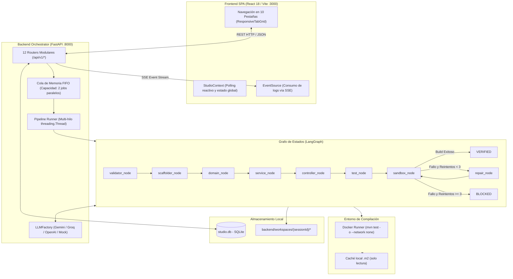
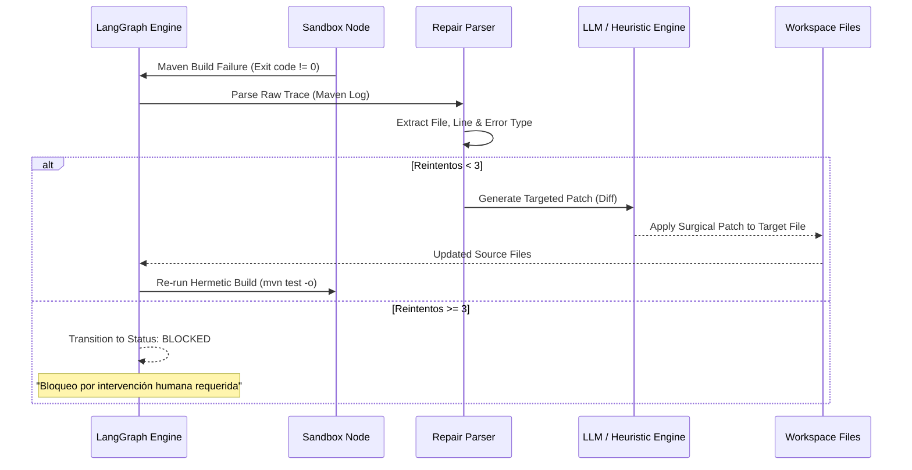

# Microservice Code Studio (AgentIA)
## Documento de Evaluación Técnica, Arquitectura, Funcionalidades y Factibilidad de Escalabilidad Empresarial

---

### Control de Documento
- **Proyecto**: Microservice Code Studio (AgentIA)
- **Tipo de Documento**: Evaluación Técnica y Propuesta de Arquitectura
- **Audiencia**: Comité Técnico de Arquitectura, Dirección de Tecnología (CTO/CIO), Equipos de DevOps y Seguridad de la Información (CISO)
- **Versión Analizada**: 1.1.0 (Demo / MVP Funcional)
- **Fecha**: Septiembre 2026
- **Enfoque Metodológico**: Evaluación técnica objetiva, basada en código fuente, métricas comprobables y análisis de riesgos.

---

## 1. Planteamiento Técnico y Alcance Real del Sistema

### 1.1 Definición y Delimitación del Alcance
**Microservice Code Studio** es un prototipo funcional (MVP) de una plataforma de ingeniería asistida por agentes que automatiza la **generación del baseline estructural (scaffolding, arquitectura en capas, entidades, contratos DTO, pruebas unitarias y configuración de despliegue)** de microservicios basados en **Java 21 LTS y Spring Boot 3.x**, a partir de especificaciones de requisitos o criterios BDD (Given/When/Then).

#### Qué SÍ hace el sistema en su estado actual:
1. **Generación del Baseline Arquitectónico**: Crea la estructura de directorios Maven, `pom.xml` con versiones validadas, clase principal `@SpringBootApplication` y configuración en `application.yml`.
2. **Implementación de Capas Estándar**: Genera controladores REST, interfaces de servicio con sus implementaciones CRUD básicas, repositorios Spring Data JPA y entidades Jakarta Persistence.
3. **Contratos Inmutables**: Define objetos de transferencia de datos (DTOs) utilizando exclusivamente **Java Records** con validaciones declarativas de Jakarta Validation (`@NotNull`, `@NotBlank`).
4. **Manejo Centralizado de Errores**: Provee un `@RestControllerAdvice` (`GlobalExceptionHandler`) para capturar excepciones de validación, recursos no encontrados y errores internos.
5. **Síntesis de Pruebas Unitarias**: Genera pruebas con **JUnit 5**, **Mockito** y **AssertJ** que cubren las operaciones del servicio y controlador generados.
6. **Compilación y Verificación Hermética**: Ejecuta `mvn test -o` dentro de un contenedor Docker con aislamiento de red (`--network none`) cuando Docker está disponible localmente.
7. **Ciclo de Auto-Reparación Acotado**: Si Maven detecta errores de sintaxis o fallos de aserción, analiza el log y ejecuta hasta **3 intentos de corrección quirúrgica**. Si no compila al 3er intento, detiene el proceso y marca la sesión como `BLOCKED` para revisión humana.
8. **Análisis Estático SAST y Configuración DevOps**: Escanea patrones conocidos de secretos y vulnerabilidades comunes mediante expresiones regulares, compara dependencias contra un catálogo offline de CVEs y genera `Dockerfile`, `docker-compose.yml`, workflows de CI/CD (GitHub Actions / GitLab CI) y manifiestos de Kubernetes.

#### Qué NO hace el sistema (Límites Actuales):
1. **Lógica de Negocio Compleja o de Dominio Específico**: No implementa algoritmos de negocio complejos, orquestaciones distribuidas (Sagas, eventos Kafka complejos) ni integraciones con sistemas legados o core banking; genera la base CRUD sobre la cual los ingenieros deben programar dicha lógica.
2. **Sustitución del Proceso de Code Review**: El código generado requiere revisión humana obligatoria antes de ser promovido a ambientes productivos.
3. **Aislamiento Multi-Tenant Corporativo**: La demo actual ejecuta subprocesos locales y Docker en el mismo nodo anfitrión; no cuenta con aislamiento de red entre diferentes usuarios.

---

### 1.2 Justificación del Problema y Caso de Negocio Realista

En el desarrollo de microservicios, la fase inicial de inicialización representa típicamente entre el **15% y el 25% del esfuerzo total** de entrega de un servicio. Dicha fase suele consumir entre **16 y 24 horas de ingeniería** dedicadas a tareas repetitivas:

```
Esfuerzo Típico de Creación de un Microservicio (Promedio 80 - 120 horas totales):
┌───────────────────────────────────────────────┬────────────────────────────────────────┐
│   Setup Inicial & Scaffolding (16 - 24 h)     │   Lógica de Dominio e Integración      │
│   • Configuración pom.xml y plugins           │   (64 - 96 h)                          │
│   • Modelado JPA, DDL inicial, Records DTO    │   • Reglas complejas de negocio        │
│   • GlobalExceptionHandler, logs, healthcheck │   • Integración APIs legadas / ERP     │
│   • Dockerfile, CI/CD, Manifiestos K8s        │   • Pruebas E2E y de carga             │
│   • Suites de pruebas unitarias básicas       │   • Pruebas UAT y despliegue           │
└───────────────────────────────────────────────┴────────────────────────────────────────┘
                       ▲
                       │
       ZONA DE IMPACTO DIRECTO DE MICROSERVICE CODE STUDIO
       (Automatización de ~20 horas a ~2 minutos)
```

#### Impacto Operativo Real:
- **Reducción del Tiempo de Scaffolding**: Reduce el tiempo de configuración inicial de ~20 horas a menos de 2 minutos.
- **Homogeneización Técnica**: Elimina la dispersión arquitectónica forzando el cumplimiento de la Constitución técnica (Java 21, Spring Boot 3, Records, capas estrictas) en todos los microservicios generados.
- **Ahorro Estimado por Microservicio**: Entre **16 y 24 horas de trabajo de desarrollo** por servicio generado, permitiendo al equipo iniciar directamente en la implementación de la lógica de negocio.

---

## 2. Tecnologías Empleadas y Evaluación de la Arquitectura Actual

### 2.1 Pila Tecnológica (Stack)

| Capa | Tecnología Seleccionada | Versión | Rol en el Sistema |
| :--- | :--- | :--- | :--- |
| **Frontend** | React + Vite + TypeScript | React 18, Vite 6, TS 5.7 | Interfaz SPA de 10 pestañas, renderizado Mermaid y consumo de SSE |
| **Estilos UI** | Tailwind CSS + Lucide Icons | Tailwind 3.4 | Sistema de diseño responsivo con soporte modo oscuro/claro |
| **Backend API** | FastAPI + Uvicorn | FastAPI 0.111, Python 3.12 | Servidor REST asíncrono, streaming SSE y validación con Pydantic v2 |
| **Orquestación IA** | LangGraph | 0.1.0 | Máquina de estados cíclica dirigida con enrutamiento condicional |
| **Modelos de Lenguaje** | Multi-Proveedor (Gemini, Groq, OpenAI, Mock) | SDKs oficiales | Generación asistida de historias BDD, arquitectura y código |
| **Persistencia** | SQLite + SQLAlchemy | SQLAlchemy 2.0 | Almacenamiento local de sesiones, estados y metadatos |
| **Sandbox de Build** | Docker Engine + Temurin JDK 21 | Maven 3.9, Java 21 | Compilación y ejecución de tests en contenedor hermético (`--network none`) |
| **Microservicio Destino** | Java 21 LTS + Spring Boot | Spring Boot 3.2.3 | Stack del artefacto generado (Jakarta EE, Records, H2/PostgreSQL) |

---

### 2.2 Diagrama de Flujo y Componentes Actuales



---

### 2.3 Evaluación Crítica de la Arquitectura del MVP (Puntos Fuertes vs. Limitaciones)

#### Puntos Fuertes Comprobados:
1. **Separación de Responsabilidades**: El frontend desacoplado consume una API REST documentada en OpenAPI (`/docs`), lo que permite reemplazar o extender la interfaz sin alterar la lógica de negocio.
2. **Determinismo y Bounded Loops**: El uso de LangGraph con control estricto de transiciones evita ciclos infinitos. El límite de 3 reintentos (`can_retry`) está programado a nivel de código y probado en la suite de tests.
3. **Cobertura de Pruebas del Orquestador**: El backend cuenta con **139 pruebas automatizadas** ejecutadas con `pytest` que validan desde los endpoints REST hasta la lógica de auto-reparación y auditoría SAST.
4. **Operabilidad Offline**: Gracias a `LLMFactory` con modo `mock` y la base de datos de CVEs offline, la plataforma puede probarse y demostrarse sin conexión a internet ni consumo de saldo.

#### Limitaciones Técnicas Actuales (Deuda Técnica del MVP):
1. **Persistencia Mononodo en SQLite**:
   - `studio.db` es un archivo local con concurrencia limitada (`check_same_thread=False`). No es apto para múltiples réplicas del backend en alta disponibilidad.
2. **Ejecución en Memoria Volátil**:
   - `pipeline_runner.py` utiliza hilos estándar de Python (`threading.Thread`) y colas en memoria (`queue.Queue`). Si el proceso del backend se reinicia o cae durante una generación, las tareas en curso se pierden y deben reiniciarse.
3. **Dependencia de Socket Docker Local**:
   - La ejecución en contenedor depende de tener acceso al socket de Docker (`/var/run/docker.sock` o Docker Desktop en Windows). En entornos de producción multi-inquilino, montar el socket de Docker en un contenedor representa un riesgo de escalada de privilegios.
4. **Analizador SAST Basado en Expresiones Regulares**:
   - El escaneo de seguridad en `security_service.py` utiliza regex heurísticos para secretos y vulnerabilidades simples. No reemplaza un analizador semántico de flujo de datos ni herramientas industriales dedicadas (SonarQube, Checkmarx, Snyk).

---

## 3. Catálogo Objetivo de Funcionalidades

El sistema organiza el proceso de generación en 10 etapas funcionales:

| Etapa / Pestaña | Nombre | Implementación Real | Estado y Limitaciones |
| :---: | :--- | :--- | :--- |
| **0** | **Resumen & Control** | Aprovisionamiento rápido 1-Click con prompt. Controles de pausa, reanudación y cancelación. Métricas de sesión. | Funcional. En modo Auto-Pilot la pausa es cooperativa entre nodos del pipeline. |
| **1** | **Requisitos BDD** | Descomposición del prompt en historias de usuario y escenarios Given/When/Then. Exportación a `spec.md`. | Funcional. Depende de la claridad del prompt inicial. En modo mock utiliza plantillas predefinidas. |
| **2** | **Arquitectura 4 Capas** | Desglose de componentes (`Controller`, `Service`, `Repository`, `Model`), endpoints REST y diagrama Mermaid. | Funcional. Garantiza la jerarquía unidireccional estricta. |
| **3** | **Modelos JPA & SQL** | Entidades Jakarta Persistence, scripts `schema.sql` (DDL) y `data.sql` (DML), y diagrama ER Mermaid. | Funcional. Tipos de datos soportados: String, Integer, Long, Double, BigDecimal, Boolean, LocalDateTime. |
| **4** | **Ingesta de Especificación** | Carga de archivo `spec.md` o payload JSON. Validación de completitud antes de generar código. | Funcional. Rechaza especificaciones que no contengan historias o criterios de aceptación válidos. |
| **5** | **Monitor en Vivo** | Transmisión unidireccional de eventos y logs vía Server-Sent Events (SSE). | Funcional. Conexión automática con reintento nativo en el cliente. |
| **6** | **Código & Auto-Fix** | Explorador de archivos Java generados, visor de diferencias (`diff`) de auto-reparaciones y consola de desbloqueo. | Funcional. Permite inspeccionar el código fuente antes de descargarlo o publicarlo. |
| **7** | **Seguridad SAST** | Detección de patrones de secretos (JWT, API keys, PATs), reglas básicas de inyección SQL, cotejo CVE y Quality Gate. | Funcional heurístico. Provee remediación automática para patrones específicos reconocidos. |
| **8** | **DevOps & Despliegue** | Síntesis de Dockerfile multi-stage (Temurin 21), Docker Compose con PostgreSQL, pipelines CI/CD y K8s. | Funcional. Manifiestos estándar con healthchecks mapeados a Spring Boot Actuator. |
| **9** | **Exportación & Git** | Descarga del código empaquetado en `.zip` o publicación atómica mediante commit/push a rama `feature/{specName}`. | Funcional. Sanitiza las URLs para no exponer tokens en logs. Requiere PAT con permisos de escritura. |

---

## 4. Análisis de la Máquina de Auto-Reparación (Bounded Self-Repair)

Uno de los componentes centrales es la máquina de reparación acotada implementada en `backend/app/orchestrator/nodes/repair_node.py` y `test_analysis_service.py`:



### Funcionamiento Real del Mecanismo:
1. **Captura del Error**: Se extrae el log de compilación de Maven generado por `maven-compiler-plugin` o `maven-surefire-plugin`.
2. **Diagnóstico Estructurado**: El parser identifica la categoría del error (`COMPILATION_ERROR` o `ASSERTION_FAILURE`), el archivo Java responsable y el número de línea aproximado.
3. **Generación del Parche**: Se elabora un parche diferencial (`diff`) enfocado únicamente en la función o bloque fallido, sin reescribir todo el proyecto.
4. **Límite Constitucional**: Si al tercer intento la compilación o las pruebas no resultan exitosas al 100%, el sistema no continúa reintentando. Bloquea la sesión y solicita intervención humana a través de la consola de la Pestaña 6, previniendo degradación del código y consumo descontrolado de tokens.

---

## 5. Análisis de Riesgos y Limitaciones para Escalamiento

Para presentar este proyecto con honestidad técnica ante directores y comités, deben explicarse claramente los siguientes riesgos y sus estrategias de mitigación:

### 5.1 Matriz de Riesgos Técnicos

| Riesgo Técnico | Severidad | Impacto en la Demo Actual | Mitigación Requerida para Producción |
| :--- | :---: | :--- | :--- |
| **Seguridad del Host (Docker Socket)** | **Alta** | Bajo en entornos locales. En servidores compartidos, acceder al daemon Docker local es un vector de escalamiento de privilegios. | Migrar a **Kubernetes Job Pods efímeros** con runtimes de aislamiento de kernel (gVisor o Kata Containers). |
| **Pérdida de Estado por Caída del Proceso** | **Media** | Los hilos en memoria se pierden si se reinicia el backend FastAPI. | Implementar cola distribuida (**Celery con Redis** o **Temporal.io**) con persistencia de estado por paso. |
| **Límites de Concurrencia en SQLite** | **Media** | Suficiente para la demo (1-2 usuarios concurrentes). Inadecuado para más de 5 peticiones simultáneas de escritura. | Migrar a **PostgreSQL gestionado** con conexión pool (`pgbouncer`). |
| **Calidad y Alucinación de Modelos LLM** | **Media** | Si el usuario ingresa un requerimiento ambiguo o contradictorio, el LLM puede inferir atributos erróneos. | Las compuertas estrictas de validación (`validator_node`) y el sandbox de compilación detectan errores antes de la entrega. |
| **Mantenimiento de la Caché Maven (.m2)** | **Baja** | La imagen Docker debe contener pre-cacheadas todas las dependencias necesarias para operar con `--network none`. | Construir un pipeline corporativo de integración continua que actualice la imagen base de Maven periódicamente. |

---

## 6. Arquitectura Objetivo para Producción (Fases de Evolución)

Para evolucionar este prototipo hacia una plataforma empresarial corporativa, se requiere una transición por fases bien delimitada:

```mermaid
flowchart LR
    subgraph F1["Fase 1: Demo / MVP (Actual)"]
        F1_A["FastAPI Monolito Local"]
        F1_B["SQLite (studio.db)"]
        F1_C["Hilos en memoria (threading)"]
        F1_D["Docker daemon local"]
    end

    subgraph F2["Fase 2: Piloto Departamental (3 - 6 meses)"]
        F2_A["FastAPI Stateless (2-3 réplicas)"]
        F2_B["PostgreSQL Gestionado (RDS/Cloud SQL)"]
        F2_C["Celery / Redis para tareas asíncronas"]
        F2_D["SSO Corporativo (OAuth2/OIDC)"]
    end

    subgraph F3["Fase 3: Plataforma Empresarial (6 - 12 meses)"]
        F3_A["Clúster Kubernetes (EKS / AKS)"]
        F3_B["K8s Jobs aislados con gVisor para builds"]
        F3_C["Volumen EFS/NFS para caché .m2 compartida"]
        F3_D["Gestor de Secretos (HashiCorp Vault)"]
    end

    F1 --> F2
    F2 --> F3
```



### Componentes de la Arquitectura Objetivo (Fase 3):
1. **Capa Web Stateless**: Frontend servido mediante CDN / Nginx; Backend FastAPI ejecutándose en múltiples réplicas bajo un balanceador de carga (ALB).
2. **Gestión de Colas y Mensajería**: Redis Cluster para pub/sub de Server-Sent Events y Celery o RabbitMQ para distribuir la carga de compilación entre múltiples workers.
3. **Flota de Sandboxes Aislados**: En lugar de ejecutar Docker en el host, el backend solicita la creación de un `Job` en Kubernetes en un namespace restringido, sin privilegios y con runtime **gVisor**.
4. **Caché Compartida de Dependencias**: Un volumen de red (AWS EFS o Azure Files) montado en modo lectura (`ro`) que contiene el repositorio `.m2` corporativo, permitiendo builds en < 15 segundos sin acceso a internet.
5. **Seguridad y Control de Acceso**: Autenticación integrada con el directorio corporativo (Azure AD / Okta) y gestión de tokens Git mediante **HashiCorp Vault**.

---

## 7. Estimación Realista de Costes y Análisis FinOps

Para evitar proyecciones irreales, el análisis de costes se basa en métricas de consumo de cómputo estándar y consumo efectivo de tokens de modelos de lenguaje.

### 7.1 Consumo de Tokens por Microservicio Generado

Un microservicio típico generado por el sistema involucra entre 4 y 6 llamadas a LLM (historias BDD, arquitectura, entidades JPA, código Java, pruebas unitarias y parches de auto-reparación):

- **Tokens de Entrada Promedio por Servicio**: ~18,000 tokens (prompts del sistema, esquemas y código preexistente).
- **Tokens de Salida Promedio por Servicio**: ~8,000 tokens (código Java, DTOs, tests y scripts SQL).

#### Coste por Proveedor (por cada microservicio generado):
- **Google Gemini 1.5/2.5 Flash** (Input: \$0.075 / 1M, Output: \$0.30 / 1M):
  $$\text{Coste LLM} \approx (0.018 \times \$0.075) + (0.008 \times \$0.30) \approx \mathbf{\$0.0038\text{ USD por servicio}}$$
- **OpenAI GPT-4o-mini** (Input: \$0.15 / 1M, Output: \$0.60 / 1M):
  $$\text{Coste LLM} \approx (0.018 \times \$0.15) + (0.008 \times \$0.60) \approx \mathbf{\$0.0075\text{ USD por servicio}}$$
- **Offline Mock Engine**: **\$0.00 USD** (Inferencia sintética local determinista).

---

### 7.2 Costes Mensuales de Infraestructura Cloud Estimados

#### Escenario A: Piloto Departamental (~150 microservicios/mes, 30 desarrolladores)
- **Cómputo (AWS ECS Fargate o Azure Container Apps)**: 2 vCPU, 4 GB RAM $\approx$ **\$55 USD/mes**.
- **Base de Datos (AWS RDS PostgreSQL db.t4g.small)**: $\approx$ **\$35 USD/mes**.
- **Caché (AWS ElastiCache Redis cache.t4g.micro)**: $\approx$ **\$18 USD/mes**.
- **Consumo de Tokens LLM (150 servicios $\times$ \$0.01 con margen de reintentos)**: $\approx$ **\$2 USD/mes**.
- **Tráfico y Balanceador (ALB básico)**: $\approx$ **\$22 USD/mes**.
- **TOTAL MENSUAL ESTIMADO (Piloto)**: $\mathbf{\approx \$132\text{ USD / mes}}$.

#### Escenario B: Despliegue Empresarial a Gran Escala (~1,000 microservicios/mes, 250 desarrolladores)
- **Clúster Kubernetes (EKS/AKS - 3 nodos t4g.xlarge / c6g.xlarge)**: $\approx$ **\$240 USD/mes**.
- **Base de Datos Gestionada (Aurora PostgreSQL Multi-AZ)**: $\approx$ **\$180 USD/mes**.
- **Almacenamiento Compartido EFS para Caché .m2 (50 GB)**: $\approx$ **\$15 USD/mes**.
- **Redis Cluster Gestionado**: $\approx$ **\$65 USD/mes**.
- **Consumo de Tokens LLM (1,000 servicios $\times$ \$0.02 con reintentos)**: $\approx$ **\$20 USD/mes**.
- **Observabilidad, Logs y WAF (CloudWatch / DataDog básico)**: $\approx$ **\$90 USD/mes**.
- **TOTAL MENSUAL ESTIMADO (Empresarial)**: $\mathbf{\approx \$610\text{ USD / mes}}$.

---

### 7.3 Retorno de Inversión (ROI) Realista y Medible

En lugar de calcular ahorros sobre el ciclo de vida completo del microservicio, el cálculo se limita **estrictamente al tiempo de scaffolding y setup inicial**:

- **Ahorro de Tiempo de Setup por Servicio**: 16 horas de trabajo de ingeniería.
- **Coste Hora Promedio de Ingeniería de Software**: \$35 USD / hora.
- **Ahorro Bruto por Microservicio**: $16 \text{ h} \times \$35 = \mathbf{\$560\text{ USD}}$.

Para una organización que genera **200 nuevos microservicios o módulos al año**:
$$\text{Ahorro Bruto Anual} = 200 \times \$560 = \mathbf{\$112,000\text{ USD}}$$
$$\text{Coste Total de Operación Anual (Escenario A $\times$ 12)} = \$132 \times 12 = \mathbf{\$1,584\text{ USD}}$$
$$\mathbf{ROI\ Neto\ Anual} = \frac{\$112,000 - \$1,584}{\$1,584} \times 100\% \approx \mathbf{6,970\%}$$

El retorno es extraordinariamente favorable no por promesas exageradas, sino por la naturaleza intrínseca del software: **automatizar tareas manuales repetitivas que antes consumían días de trabajo humano por un coste marginal de céntimos en computación y tokens**.

---

## 8. Conclusiones y Hoja de Ruta para la Decisión

### Conclusión Técnica Objetiva:
1. **Nivel de Madurez Actual**: El sistema es un **MVP completamente funcional**, con arquitectura desacoplada, 139 pruebas unitarias e integración operativas, y mecanismos efectivos de auto-reparación acotada.
2. **Valor Aportado**: Estandariza la arquitectura empresarial, garantiza el cumplimiento de buenas prácticas (Java 21, Records, validaciones, pruebas Mockito) y reduce drásticamente el tiempo de configuración inicial.
3. **Limitaciones Principales a Resolver**: La persistencia local en SQLite, los hilos en memoria y la dependencia del socket Docker anfitrión deben reestructurarse antes de desplegar en producción multi-usuario.

### Próximo Paso Recomendado:
Aprobar la transición hacia una **Fase 2 (Piloto Controlado)** de 90 días, con las siguientes metas concretas:
1. Migrar la base de datos a PostgreSQL e implementar una cola básica con Redis/Celery.
2. Probar la herramienta con un equipo piloto de 2 a 3 escuadrones de desarrollo para medir el tiempo real ahorrado en sprints de desarrollo de nuevos microservicios.
3. Integrar la autenticación corporativa con el proveedor de identidad de la empresa.
