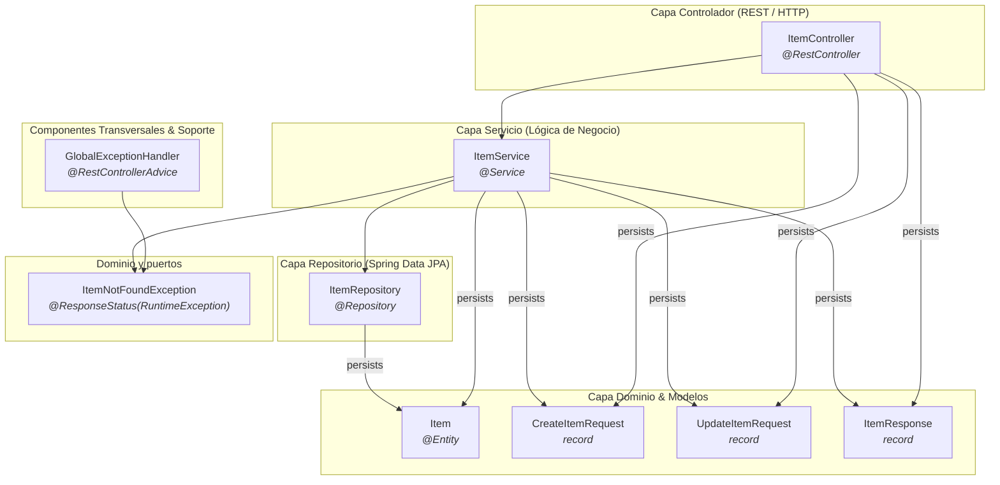

# Arquitectura: flow-inventory-service

```mermaid
flowchart TD
    subgraph Presentation["Capa Controlador (REST / HTTP)"]
        ItemController["ItemController<br/><i>@RestController</i>"]
    end
    subgraph Business["Capa Servicio (Lógica de Negocio)"]
        ItemService["ItemService<br/><i>@Service</i>"]
    end
    subgraph Persistence["Capa Repositorio (Spring Data JPA)"]
        ItemRepository["ItemRepository<br/><i>@Repository</i>"]
    end
    subgraph Domain["Capa Dominio & Modelos"]
        Item["Item<br/><i>@Entity</i>"]
        CreateItemRequest["CreateItemRequest<br/><i>record</i>"]
        UpdateItemRequest["UpdateItemRequest<br/><i>record</i>"]
        ItemResponse["ItemResponse<br/><i>record</i>"]
    end
    subgraph Infrastructure["Componentes Transversales & Soporte"]
        GlobalExceptionHandler["GlobalExceptionHandler<br/><i>@RestControllerAdvice</i>"]
    end
    subgraph HexDomain["Dominio y puertos"]
        ItemNotFoundException["ItemNotFoundException<br/><i>@ResponseStatus(RuntimeException)</i>"]
    end
    ItemRepository -->|persists| Item
    ItemService --> ItemRepository
    ItemService --> ItemNotFoundException
    ItemService -->|persists| Item
    ItemService -->|persists| CreateItemRequest
    ItemService -->|persists| UpdateItemRequest
    ItemService -->|persists| ItemResponse
    ItemController --> ItemService
    ItemController -->|persists| CreateItemRequest
    ItemController -->|persists| UpdateItemRequest
    ItemController -->|persists| ItemResponse
    GlobalExceptionHandler --> ItemNotFoundException
```
