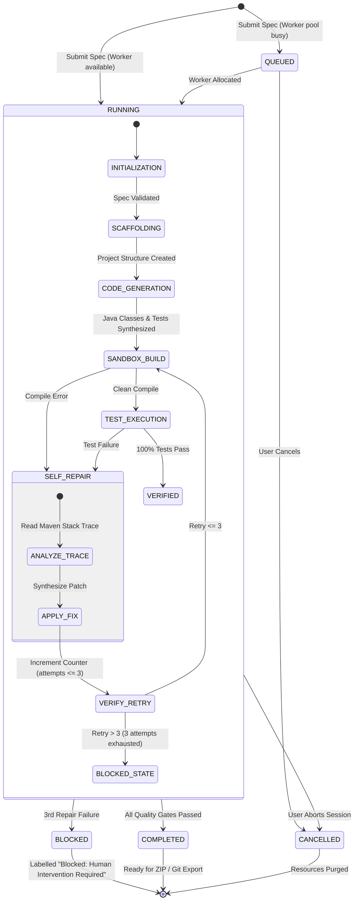
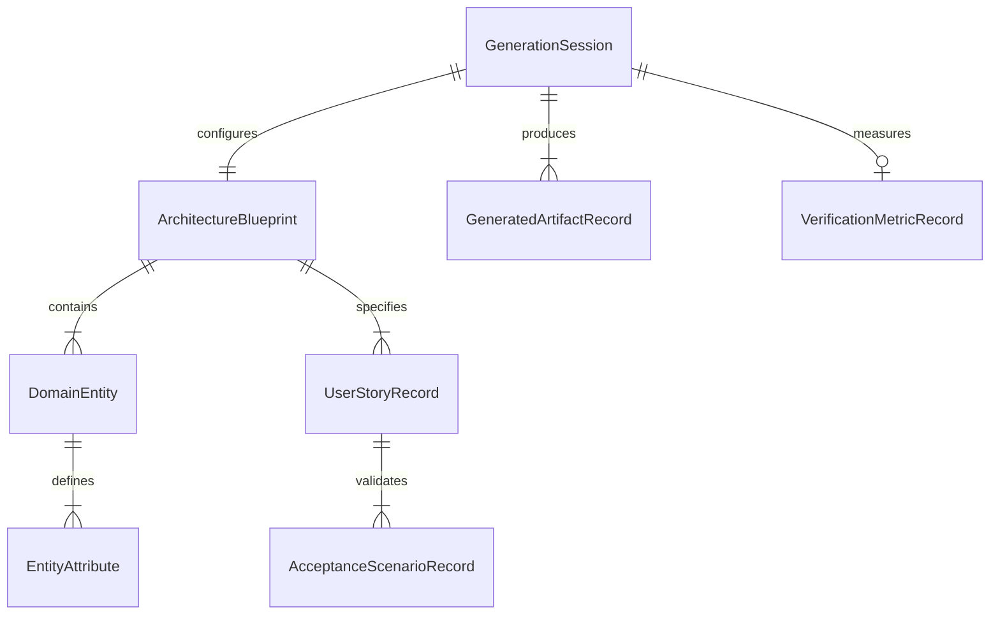

# Data Model: Microservice Code Studio

**Feature**: `001-microservice-code-studio`
**Date**: 2026-09-13
**Status**: Completed (Mapped to FastAPI Pydantic v2 & SQLAlchemy models)

## 1. Domain Entities & Value Objects

### 1.1 GenerationSession (SQLAlchemy Model & Pydantic Schema)
Represents an execution run of the code synthesis, build, and test lifecycle for a microservice.

| Field | Type | Nullable | Validation Rules | Description |
|-------|------|:--------:|------------------|-------------|
| `id` | UUID / str | No | Primary Key | Unique session identifier |
| `specName` | String | No | Max 100 chars, alphanumeric + hyphens | Identifier of the ingested specification |
| `status` | Enum | No | Values: `QUEUED`, `RUNNING`, `COMPLETED`, `BLOCKED`, `CANCELLED` | Lifecycle state |
| `phase` | Enum | No | Values: `INITIALIZATION`, `SCAFFOLDING`, `CODE_GENERATION`, `SANDBOX_BUILD`, `TEST_EXECUTION`, `SELF_REPAIR`, `VERIFIED`, `FAILED` | Granular processing stage |
| `queuePosition` | Integer | Yes | Value >= 0 when `status == QUEUED` | Position in the FIFO concurrency queue |
| `repairAttempts` | Integer | No | Min 0, Max 3 | Counter for automated repair iterations |
| `createdAt` | DateTime | No | Auto-generated timestamp | Session creation time |
| `startedAt` | DateTime | Yes | Populated on state transition to `RUNNING` | Processing start time |
| `completedAt` | DateTime | Yes | Populated on terminal state | Completion or failure timestamp |
| `errorMessage` | String | Yes | Max 4000 chars | Diagnostic failure reason if blocked/failed |

---

### 1.2 ArchitectureBlueprint (Pydantic Schema)
Represents the structural specification of the microservice to be generated.

| Field | Type | Nullable | Validation Rules | Description |
|-------|------|:--------:|------------------|-------------|
| `serviceName` | str | No | Matches regex `^[a-z0-9-]+$` | Canonical microservice name |
| `packageName` | str | No | Valid Java package name (e.g., `com.corp.order`) | Base package for all classes |
| `basePort` | int | No | Range 1024 - 65535, default: 8080 | Default HTTP port |
| `databaseMode` | str | No | Fixed: `PostgreSQL` | H2 compatibility mode for tests |
| `layers` | List[LayerDefinition] | No | Must include `controller`, `service`, `repository`, `model` | Architectural layers |
| `entities` | List[DomainEntity] | No | Min 1 domain entity | Business entities to scaffold |

#### 1.2.1 DomainEntity (Pydantic Schema)
- `name` (str, required): PascalCase entity name (e.g., `Order`, `Customer`).
- `tableName` (str, required): Snake_case table name (e.g., `orders`, `customers`).
- `attributes` (List[EntityAttribute], required): Attribute definitions.

#### 1.2.2 EntityAttribute (Pydantic Schema)
- `name` (str, required): camelCase field name.
- `type` (str, required): Java type (`String`, `Long`, `BigDecimal`, `UUID`, `Instant`, `Boolean`).
- `nullable` (bool, required): Whether attribute accepts nulls.
- `validationRules` (List[str]): Jakarta Validation rules (`@NotNull`, `@NotBlank`, `@Positive`, etc.).
- `isPrimaryKey` (bool, required): Identifies entity primary key.

---

### 1.3 UserStoryRecord & AcceptanceScenarioRecord (Pydantic Schemas)
Represents the functional requirements driving code and test synthesis.

#### UserStoryRecord
| Field | Type | Nullable | Validation Rules | Description |
|-------|------|:--------:|------------------|-------------|
| `id` | str | No | Unique per blueprint (e.g., `US-1`) | User story identifier |
| `priority` | Enum | No | Values: `P1`, `P2`, `P3` | Business priority ranking |
| `role` | str | No | Not blank, max 100 chars | Stakeholder role (e.g., "Developer") |
| `intent` | str | No | Not blank, max 255 chars | Desired action or capability |
| `benefit` | str | No | Not blank, max 255 chars | Business value or rationale |
| `scenarios` | List[AcceptanceScenarioRecord] | No | Min 1 scenario required | Given/When/Then acceptance criteria |

#### AcceptanceScenarioRecord
| Field | Type | Nullable | Validation Rules | Description |
|-------|------|:--------:|------------------|-------------|
| `scenarioId` | str | No | Unique per story (e.g., `AC-1.1`) | Scenario identifier |
| `givenClause` | str | No | Not blank | Precondition description |
| `whenClause` | str | No | Not blank | Triggering event or API request |
| `thenClause` | str | No | Not blank | Expected outcome or assertion |

---

### 1.4 GeneratedArtifactRecord (SQLAlchemy Model & Pydantic Schema)
Represents a generated source, configuration, or test file produced by the studio.

| Field | Type | Nullable | Validation Rules | Description |
|-------|------|:--------:|------------------|-------------|
| `id` | UUID / str | No | Primary Key | Artifact identifier |
| `sessionId` | UUID / str | No | Foreign key to `GenerationSession` | Associated session |
| `relativePath` | str | No | Non-empty, valid relative path | File path (e.g., `src/main/java/.../OrderController.java`) |
| `fileType` | Enum | No | Values: `JAVA_SOURCE`, `JAVA_RECORD`, `POM_XML`, `YAML_CONFIG`, `TEST_SOURCE` | File classification |
| `content` | Text | No | UTF-8 text content | Source code or file body |
| `sizeBytes` | int | No | >= 0 | File size in bytes |
| `checksum` | str | No | SHA-256 hex string | Content integrity hash |

---

### 1.5 VerificationMetricRecord (SQLAlchemy Model & Pydantic Schema)
Represents the automated test and build validation outcomes.

| Field | Type | Nullable | Validation Rules | Description |
|-------|------|:--------:|------------------|-------------|
| `id` | UUID / str | No | Primary Key | Metric record identifier |
| `sessionId` | UUID / str | No | Foreign key to `GenerationSession` | Associated session |
| `totalTests` | int | No | >= 0 | Total JUnit 5 tests executed |
| `passedTests` | int | No | >= 0 | Successfully passed tests |
| `failedTests` | int | No | >= 0 | Failed test count (must be 0 for success) |
| `executionDurationMs` | int | No | >= 0 | Total execution time in milliseconds |
| `allPassed` | bool | No | True if `failedTests == 0` and `totalTests > 0` | Build verification pass flag |
| `surefireReportJson` | Text | Yes | Valid JSON string | Detailed report of individual test executions |

---

## 2. State Machine: GenerationSession Lifecycle (LangGraph State)

---

## 3. Entity Relationships

