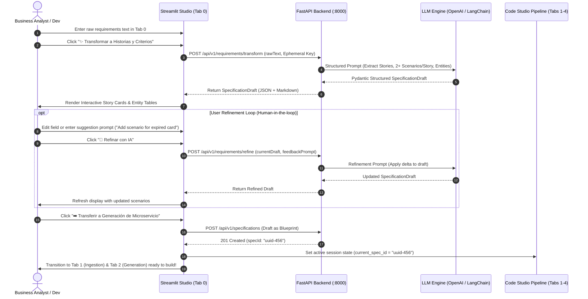

# Data Model: Requirements to Stories & Criteria Transformation

**Feature**: `002-requirements-to-stories`  
**Date**: 2026-09-13  
**Status**: Ready for Implementation  

---

## 1. Data Schema Definitions

### 1.1 `RequirementsTransformRequest`
Request payload sent to `POST /api/v1/requirements/transform`.

| Field | Type | Required | Description |
|---|---|:---:|---|
| `rawText` | `str` | Yes | Raw requirements narrative, bullet points, or user notes (minimum 10 characters). |
| `serviceName` | `str` | No | Optional pre-assigned service name (e.g. `billing-service`). Auto-derived if omitted. |
| `packageName` | `str` | No | Optional base Java package (e.g. `com.corp.billing`). Defaults to `com.corp.{serviceName}`. |
| `apiKey` | `str` | No | Ephemeral LLM API key (if not supplied via `X-LLM-API-Key` header or environment). |

---

### 1.2 `RefinementRequest`
Request payload sent to `POST /api/v1/requirements/refine` for human-in-the-loop adjustments.

| Field | Type | Required | Description |
|---|---|:---:|---|
| `currentDraft` | `SpecificationDraft` | Yes | Current state of the draft specification including entities and user stories. |
| `feedbackPrompt` | `str` | Yes | User natural language instructions (e.g. *"add a negative test for balance below zero"*). |
| `targetStoryId` | `str` | No | Optional identifier of a specific story to re-synthesize (e.g. `US-2`). If omitted, applies globally. |
| `apiKey` | `str` | No | Ephemeral LLM API key. |

---

### 1.3 `SpecificationDraft`
Output returned by transform/refine endpoints, completely compatible with `ArchitectureBlueprint`.

| Field | Type | Required | Description |
|---|---|:---:|---|
| `serviceName` | `str` | Yes | Hyphenated service name (e.g. `payment-service`). |
| `packageName` | `str` | Yes | Reverse domain Java package (e.g. `com.corp.payment`). |
| `basePort` | `int` | Yes | Default port (8080). |
| `entities` | `List[DomainEntity]` | Yes | List of extracted domain entities, attributes, and primary keys. |
| `userStories` | `List[UserStoryRecord]` | Yes | List of synthesized stories, each with role, intent, benefit, and >= 2 acceptance scenarios. |
| `assumptions` | `List[str]` | No | List of assumptions made during analysis (e.g. data retention defaults). |
| `markdownSpec` | `str` | Yes | Pre-rendered Spec Kit compliant `spec.md` string for download. |

---

## 2. Interactive Refinement & Handoff Sequence Diagram

