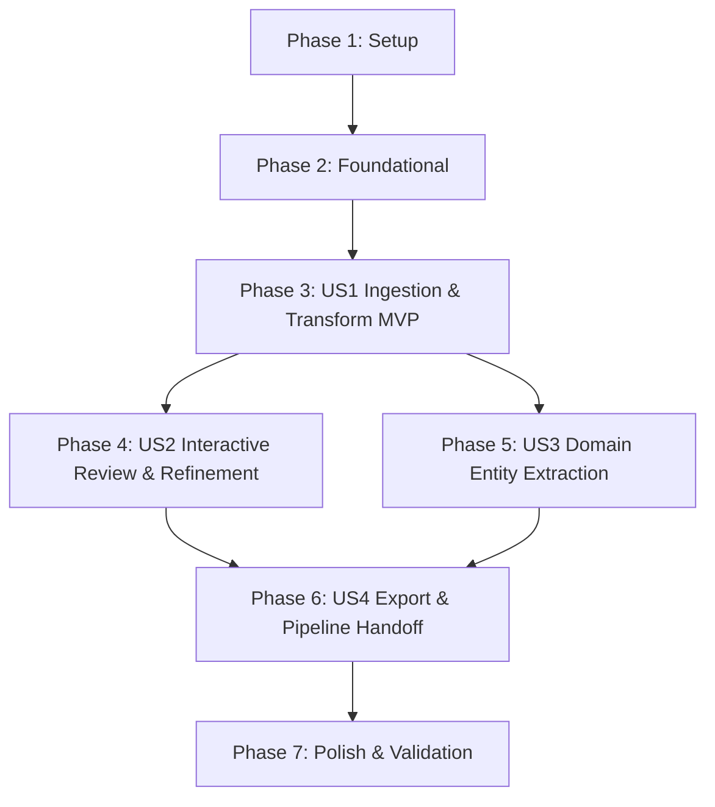

# Tasks: Natural Language Requirements to User Stories & Acceptance Criteria Transformation

**Branch**: `002-requirements-to-stories` | **Date**: 2026-09-13 | **Spec**: [spec.md](./spec.md) | **Plan**: [plan.md](./plan.md)

---

## Phase 1: Setup (Shared Infrastructure)

**Purpose**: Project initialization and validation of dependencies for requirements transformation.

- [X] T001 Verify backend dependencies (`fastapi>=0.111.0`, `pydantic>=2.7.0`, `langchain-openai>=0.1.0`, `httpx`) in `backend/requirements.txt`
- [X] T002 [P] Export requirements models in `backend/app/models/__init__.py`

---

## Phase 2: Foundational (Blocking Prerequisites)

**Purpose**: Core data schemas, API routing, and security guards that MUST be complete before ANY user story can be implemented.

**⚠️ CRITICAL**: No user story work can begin until this phase is complete.

- [X] T003 Implement Pydantic data schemas in `backend/app/models/requirements.py`: `RequirementsTransformRequest` with fields `rawText` (required, "minimum 10 characters", `min_length=10`), `serviceName` (optional, "e.g. billing-service"), `packageName` (optional, "e.g. com.corp.billing"), `apiKey` (optional ephemeral key); `RefinementRequest` with fields `currentDraft` (`SpecificationDraft`, required), `feedbackPrompt` (str, required), `targetStoryId` (optional str), `apiKey` (optional); `SpecificationDraft` with `serviceName` (str), `packageName` (str), `basePort` (int, default 8080), `entities` (List[`DomainEntity`]), `userStories` (List[`UserStoryRecord`], each with `scenarios` minItems 2), `assumptions` (List[str]), and `markdownSpec` (str)
- [X] T004 [P] Implement markdown serialization helper in `backend/app/services/requirements_service.py` to format `SpecificationDraft` into Spec Kit compliant `spec.md` with service metadata, entities table, and Given/When/Then scenarios
- [X] T005 [P] Implement API key resolution dependency helper in `backend/app/api/routes_requirements.py` that inspects `X-LLM-API-Key` header, payload `apiKey`, and `OPENAI_API_KEY` environment variable, raising HTTP 401 (`ApiErrorResponse`) when missing per Constitution Principle VI
- [X] T006 Mount requirements router under `/api/v1/requirements` in `backend/app/main.py`

**Checkpoint**: Foundation ready - request/response models and routing infrastructure operational.

---

## Phase 3: User Story 1 - Natural Language Requirements Ingestion and Transformation (Priority: P1) 🎯 MVP

**Goal**: Allow users to input raw natural language requirements or bullet points in Tab 0, call `POST /api/v1/requirements/transform`, and automatically decompose them into prioritized User Stories (`As a [role], I want [action], so that [benefit]`) where each story contains at least two acceptance scenarios (1 happy path + 1 validation/error).

**Independent Test**: Submit a raw narrative (>= 10 chars) to `POST /api/v1/requirements/transform` with an ephemeral API key (or mock), verify HTTP 200 containing structured `userStories` where every story has `id` (`US-x`), `priority` (`P1`, `P2`, or `P3`), `role`, `intent`, `benefit`, and at least 2 scenarios (`scenarioId`, `given`, `when`, `then`).

### Tests for User Story 1

- [X] T007 [P] [US1] Contract test for `POST /api/v1/requirements/transform` covering 200 success response, 400 Bad Request when `rawText` < 10 characters, and 401 Unauthorized when no API key is supplied in `backend/tests/test_routes_requirements.py`
- [X] T008 [P] [US1] Unit test for LLM decomposition and BDD scenario generation verifying prompt formatting, role/intent/benefit extraction, and enforcement of `>= 2` acceptance scenarios (at least 1 happy path and 1 validation/error) in `backend/tests/test_requirements_service.py`

### Implementation for User Story 1

- [X] T009 [US1] Implement LLM prompt template and structured extraction logic using `ChatOpenAI.with_structured_output` with fallback error handling in `backend/app/services/requirements_service.py`
- [X] T010 [US1] Implement `POST /api/v1/requirements/transform` endpoint invoking transformation service in `backend/app/api/routes_requirements.py`
- [X] T011 [US1] Implement requirements input form and transformation trigger view in `frontend/views/requirements_view.py`
- [X] T012 [US1] Register Tab 0 ("📝 0. Redacción & Asistente de Requisitos") in `frontend/app.py` with API key validation guard and settings sidebar integration

**Checkpoint**: User Story 1 fully functional and testable as an MVP increment.

---

## Phase 4: User Story 2 - Interactive Review, Editing, and Refinement of Derived Stories (Priority: P2)

**Goal**: Provide an interactive web interface to review and edit generated stories and scenarios, add/delete criteria, and submit natural language feedback prompts (`POST /api/v1/requirements/refine`) for AI-assisted refinement.

**Independent Test**: Provide an existing `SpecificationDraft` and feedback prompt (e.g. *"add a negative test for balance below zero"*) to `POST /api/v1/requirements/refine`, verify HTTP 200 response with updated scenarios reflecting user feedback.

### Tests for User Story 2

- [X] T013 [P] [US2] Contract test for `POST /api/v1/requirements/refine` validating global refinement and targeted story refinement (`targetStoryId`) in `backend/tests/test_routes_requirements.py`
- [X] T014 [P] [US2] Unit test for `refine_specification` method applying user feedback deltas to `SpecificationDraft` in `backend/tests/test_requirements_service.py`

### Implementation for User Story 2

- [X] T015 [US2] Implement `refine_specification` service method in `backend/app/services/requirements_service.py` that merges user instructions into the active specification draft
- [X] T016 [US2] Implement `POST /api/v1/requirements/refine` endpoint in `backend/app/api/routes_requirements.py`
- [X] T017 [US2] Implement interactive story card editor (in-place text edits, priority selector, add scenario `AC-X.Y`, delete scenario, delete story) in `frontend/views/requirements_view.py`
- [X] T018 [US2] Implement natural language refinement chat/prompt box with iterative state updates in `frontend/views/requirements_view.py`

**Checkpoint**: User Stories 1 and 2 work together, enabling complete human-in-the-loop review and iterative AI refinement.

---

## Phase 5: User Story 3 - Domain Entity and Attribute Extraction (Priority: P2)

**Goal**: Automatically extract business domain entities from requirements text with typed attributes (`String`, `Long`, `BigDecimal`, `Boolean`, `DateTime`, `UUID`), table mappings, primary keys, and validation rules, editable in the UI.

**Independent Test**: Submit requirements referencing business entities (e.g. "payment with amount and currency"), verify that `DomainEntity` objects are produced with typed attributes, primary key flags, and are editable in the frontend.

### Tests for User Story 3

- [X] T019 [P] [US3] Unit test for domain entity extraction and attribute type mapping (`BigDecimal`, `UUID`, etc.) in `backend/tests/test_requirements_service.py`

### Implementation for User Story 3

- [X] T020 [US3] Update LLM system prompt and extraction schema in `backend/app/services/requirements_service.py` to extract entities with typed attributes (`String`, `Long`, `BigDecimal`, `Boolean`, `DateTime`, `UUID`), table mappings, and primary keys
- [X] T021 [US3] Implement domain entity review table and attribute editor (add/edit attribute name, type, nullability, primary key toggle) in `frontend/views/requirements_view.py`

**Checkpoint**: Functional stories and domain models are synthesized and editable simultaneously.

---

## Phase 6: User Story 4 - Specification Export and Code Studio Pipeline Handoff (Priority: P3)

**Goal**: Export the reviewed specification as a compliant Spec Kit `spec.md` markdown file and provide a single-click handoff to transfer the blueprint directly to the Microservice Code Studio generator (`POST /api/v1/specifications`).

**Independent Test**: Click "Descargar spec.md" and verify valid markdown is downloaded; click "Transferir a Generador" and verify blueprint is saved into `SPECIFICATIONS_STORE`, `st.session_state.current_spec_id` is populated, and UI switches to Tab 1 / Tab 2.

### Tests for User Story 4

- [X] T022 [P] [US4] Integration test verifying handoff from `SpecificationDraft` into `POST /api/v1/specifications` creating a valid `ArchitectureBlueprint` in `backend/tests/test_routes_requirements.py`

### Implementation for User Story 4

- [X] T023 [US4] Implement Spec Kit markdown export generator ensuring adherence to `.specify/templates/spec-template.md` in `backend/app/services/requirements_service.py`
- [X] T024 [US4] Implement "Descargar spec.md" button and "➡️ Transferir a Generación de Microservicio" handoff button in `frontend/views/requirements_view.py`
- [X] T025 [US4] Connect handoff flow to `POST /api/v1/specifications` and bind `st.session_state.current_spec_id` with notification and navigation in `frontend/app.py`

**Checkpoint**: End-to-end pipeline from natural language requirements to running microservice code generation is complete.

---

## Phase 7: Polish & Cross-Cutting Concerns

**Purpose**: Quality hardening, end-to-end validation, and documentation.

- [X] T026 [P] Validate quickstart scenarios against running application per `specs/002-requirements-to-stories/quickstart.md`
- [X] T027 Run full test suite (`python -m pytest backend/tests -o pythonpath=backend`) ensuring 100% pass across all existing and new tests
- [X] T028 [P] Update `README.md` with requirements transformation wizard documentation and ephemeral API key instructions

---

## Dependencies & Execution Order

### Phase Dependencies

- **Setup (Phase 1)**: No dependencies - can start immediately.
- **Foundational (Phase 2)**: Depends on Phase 1 completion - BLOCKS all user stories.
- **User Story 1 (Phase 3)**: Depends on Phase 2 - MVP milestone.
- **User Story 2 (Phase 4)**: Depends on Phase 3 (extends story editing & refinement).
- **User Story 3 (Phase 5)**: Can run in parallel with or immediately after Phase 4.
- **User Story 4 (Phase 6)**: Depends on Phases 3, 4, and 5 (final handoff and export of completed specification).
- **Polish (Phase 7)**: Depends on all user stories being complete.

### User Story Dependencies



### Parallel Opportunities

- Within Phase 1: `T002` can run alongside `T001`.
- Within Phase 2: `T004` and `T005` can run in parallel after `T003`.
- Within Phase 3: Contract test `T007` and unit test `T008` can be written in parallel.
- Within Phase 4: `T013` and `T014` can be written in parallel.
- Within Phase 7: `T026` and `T028` can run in parallel.

---

## Parallel Example: User Story 1

```bash
# Launch test creation for User Story 1 together:
Task T007: "Contract test for POST /api/v1/requirements/transform in backend/tests/test_routes_requirements.py"
Task T008: "Unit test for LLM decomposition and BDD scenario generation in backend/tests/test_requirements_service.py"

# Implementation tasks sequence:
Task T009: "Implement LLM prompt template and structured extraction logic in backend/app/services/requirements_service.py"
Task T010: "Implement POST /api/v1/requirements/transform endpoint in backend/app/api/routes_requirements.py"
Task T011: "Implement requirements input form in frontend/views/requirements_view.py"
Task T012: "Register Tab 0 in frontend/app.py"
```

---

## Implementation Strategy

### MVP First (User Story 1 Only)

1. Complete Phase 1 (Setup) and Phase 2 (Foundational).
2. Complete Phase 3 (User Story 1: Ingestion & Transformation).
3. **STOP and VALIDATE**: Verify raw requirements are transformed into prioritized stories with `>= 2` Given/When/Then scenarios.

### Incremental Delivery

1. Setup + Foundational -> Foundation ready.
2. US1 -> Transformation MVP works.
3. US2 -> Interactive editing and AI feedback refinement works.
4. US3 -> Domain entity extraction and editing works.
5. US4 -> Spec Kit markdown export and direct handoff to Feature 001 generator works.
6. Polish -> 100% test coverage and documentation.
