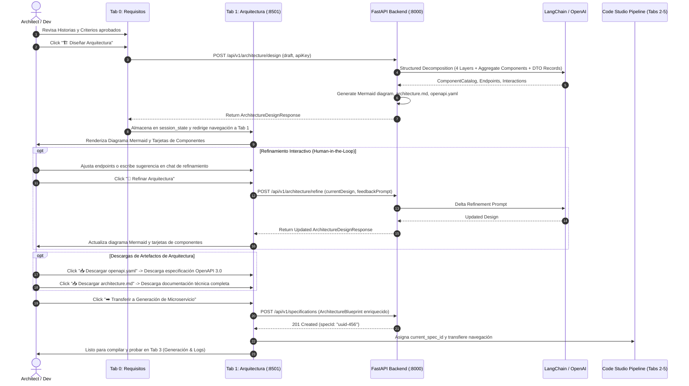

# Data Model: Automated Architecture & Component Design

**Feature**: `003-architecture-component-design`  
**Date**: 2026-09-13  
**Status**: Ready for Implementation  

---

## 1. Entity & Schema Definitions

### 1.1 `ComponentDefinition`
Represents a concrete software class/component within the Spring Boot 3 layered architecture.

| Field | Type | Required | Description |
|:---|:---|:---:|:---|
| `name` | `str` | Yes | PascalCase component name, e.g. `OrderController`, `OrderService`, `OrderRepository`. |
| `layer` | `str` | Yes | Architectural layer: `controller`, `service`, `repository`, `model`, or `infrastructure`. |
| `stereotype` | `str` | Yes | Spring annotation / role: `@RestController`, `@Service`, `@Repository`, `@Entity`, `@RestControllerAdvice`, `record`. |
| `packageName` | `str` | Yes | Full Java package, e.g. `com.corp.order.controller`. |
| `responsibilities` | `List[str]` | Yes | High-level responsibilities fulfilled by the component. |
| `dependencies` | `List[str]` | Yes | List of component names this component depends on (must be strictly unidirectional). |
| `mappedStories` | `List[str]` | No | List of User Story IDs (`US-1`, `US-2`) supported by this component. |

---

### 1.2 `ApiEndpointDefinition`
Represents an individual REST API route derived from Given/When/Then scenarios.

| Field | Type | Required | Description |
|:---|:---|:---:|:---|
| `method` | `str` | Yes | HTTP Method: `GET`, `POST`, `PUT`, `DELETE`, or `PATCH`. |
| `path` | `str` | Yes | Route path, e.g. `/api/v1/orders`, `/api/v1/orders/{id}`. |
| `summary` | `str` | Yes | Summary of the business operation. |
| `requestDto` | `Optional[str]` | No | Inbound Java Record name, e.g. `CreateOrderRequest` (with Jakarta annotations). |
| `responseDto` | `Optional[str]` | No | Outbound Java Record name, e.g. `OrderResponse`. |
| `successStatus` | `int` | Yes | Expected HTTP success code (200, 201, 204). |
| `errorStatuses` | `List[int]` | Yes | Expected HTTP client/server error codes (e.g. `[400, 404, 500]`). |
| `mappedScenarioId` | `Optional[str]` | No | Identifier of the acceptance scenario (e.g. `AC-1.1`). |

---

### 1.3 `ComponentInteraction`
Represents a directional flow or invocation boundary between two components.

| Field | Type | Required | Description |
|:---|:---|:---:|:---|
| `sourceComponent` | `str` | Yes | Calling component name, e.g. `OrderController`. |
| `targetComponent` | `str` | Yes | Target component name, e.g. `OrderService`. |
| `interactionType` | `str` | Yes | Nature of interaction: `calls`, `persists`, `maps`, `intercepts`. |

---

### 1.4 `ArchitectureDesignResponse`
Aggregated architectural model returned by the backend and visualized in the Streamlit UI.

| Field | Type | Required | Description |
|:---|:---|:---:|:---|
| `serviceName` | `str` | Yes | Hyphenated service name (e.g. `order-service`). |
| `packageName` | `str` | Yes | Base Java package (e.g. `com.corp.order`). |
| `basePort` | `int` | Yes | Default service port (8080). |
| `components` | `List[ComponentDefinition]` | Yes | Full catalog of layered and cross-cutting components. |
| `endpoints` | `List[ApiEndpointDefinition]` | Yes | Catalog of derived REST endpoints with DTOs and status codes. |
| `interactions` | `List[ComponentInteraction]` | Yes | Directional dependencies for diagramming and validation. |
| `mermaidDiagram` | `str` | Yes | Pre-rendered Mermaid.js flowchart code for direct UI rendering. |
| `architectureMarkdown` | `str` | Yes | Pre-rendered `architecture.md` specification document for download. |
| `openapiYaml` | `str` | Yes | Pre-rendered OpenAPI 3.0 YAML specification for download. |

---

### 1.5 `ArchitectureDesignRequest` & `ArchitectureRefinementRequest`
Payloads sent to `POST /api/v1/architecture/design` and `POST /api/v1/architecture/refine`.

- **`ArchitectureDesignRequest`**:
  - `draft`: `SpecificationDraft` (contains entities, stories, Given/When/Then scenarios).
  - `apiKey`: `Optional[str]` (ephemeral OpenAI API key).
- **`ArchitectureRefinementRequest`**:
  - `currentDesign`: `ArchitectureDesignResponse`.
  - `feedbackPrompt`: `str` (e.g. *"separar la persistencia de pagos en un gateway independiente"*).
  - `targetComponent`: `Optional[str]` (optional component name to target).
  - `apiKey`: `Optional[str]`.

---

## 2. Interaction Sequence Diagram

