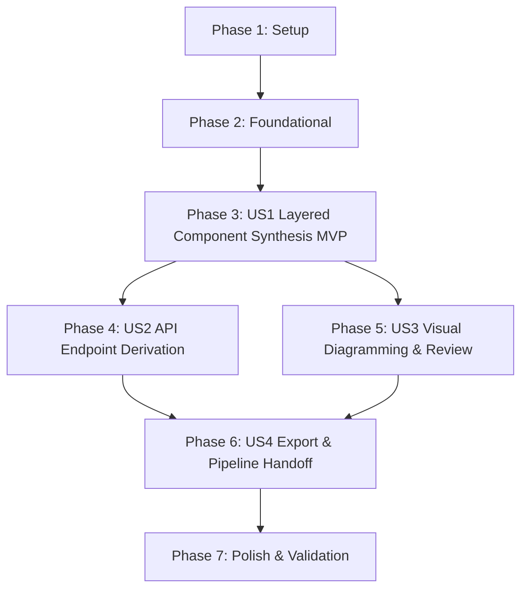

# Tasks: Automated Architecture & Component Design from User Stories

**Branch**: `003-architecture-component-design` | **Date**: 2026-09-13 | **Spec**: [spec.md](./spec.md) | **Plan**: [plan.md](./plan.md)

---

## Phase 1: Setup (Shared Infrastructure)

**Purpose**: Project initialization and dependencies setup for architecture synthesis.

- [X] T001 Verify backend dependencies (`fastapi>=0.111.0`, `pydantic>=2.7.0`, `langchain-openai>=0.1.0`, `pyyaml>=6.0.0`) in `backend/requirements.txt`
- [X] T002 [P] Export architecture models in `backend/app/models/__init__.py`

---

## Phase 2: Foundational (Blocking Prerequisites)

**Purpose**: Core data schemas, serializers, API routing, and security guards that MUST be complete before ANY user story can be implemented.

**⚠️ CRITICAL**: No user story work can begin until this phase is complete.

- [X] T003 Implement Pydantic data schemas in `backend/app/models/architecture.py`: `ComponentDefinition` with fields `name` (str), `layer` (enum: `controller`, `service`, `repository`, `model`, `infrastructure`), `stereotype` (str), `packageName` (str), `responsibilities` (List[str]), `dependencies` (List[str]), `mappedStories` (List[str]); `ApiEndpointDefinition` with fields `method` (enum: `GET`, `POST`, `PUT`, `DELETE`, `PATCH`), `path` (str), `summary` (str), `requestDto` (Optional[str]), `responseDto` (Optional[str]), `successStatus` (int), `errorStatuses` (List[int]), `mappedScenarioId` (Optional[str]); `ComponentInteraction` with fields `sourceComponent` (str), `targetComponent` (str), `interactionType` (enum: `calls`, `persists`, `maps`, `intercepts`); `ArchitectureDesignRequest` (`draft`: `SpecificationDraft`, `apiKey`: Optional[str]); `ArchitectureRefinementRequest` (`currentDesign`: `ArchitectureDesignResponse`, `feedbackPrompt`: str, `targetComponent`: Optional[str], `apiKey`: Optional[str]); and `ArchitectureDesignResponse` (`serviceName`, `packageName`, `basePort`, `components`, `endpoints`, `interactions`, `mermaidDiagram`, `architectureMarkdown`, `openapiYaml`)
- [X] T004 [P] Implement OpenAPI 3.0 YAML serialization helper in `backend/app/services/architecture_service.py` to generate compliant `openapi.yaml` from `ApiEndpointDefinition` records and DTO schemas
- [X] T005 [P] Implement Mermaid flowchart generator helper in `backend/app/services/architecture_service.py` to produce directional subgraphs (`Controller`, `Service`, `Repository`, `Model`, `Infrastructure`) enforcing unidirectional dependencies
- [X] T006 Mount architecture router under `/api/v1/architecture` in `backend/app/main.py`

**Checkpoint**: Foundation ready - request/response schemas, serializers, and routing operational.

---

## Phase 3: User Story 1 - Automated Component & Layered Architecture Synthesis (Priority: P1) 🎯 MVP

**Goal**: Automatically synthesize a strict 4-layer Spring Boot 3 architecture (`controller` ➔ `service` ➔ `repository` ➔ `model`/`entity`) with cross-cutting infrastructure (`@RestControllerAdvice`) from a `SpecificationDraft`, organized by domain aggregate.

**Independent Test**: Submit a valid `SpecificationDraft` to `POST /api/v1/architecture/design` with an API key (or mock), verify HTTP 200 response with `components` grouped by domain aggregate, strict unidirectional `dependencies` with zero cycles, and valid `mermaidDiagram`.

### Tests for User Story 1

> **NOTE: Write these tests FIRST, ensure they FAIL before implementation**

- [X] T007 [P] [US1] Contract test for `POST /api/v1/architecture/design` covering 200 success, 400 Bad Request on invalid draft, and 401 Unauthorized on missing API key in `backend/tests/test_routes_architecture.py`
- [X] T008 [P] [US1] Unit test for architecture synthesis service verifying 4-layer topology, aggregate grouping, and unidirectional flow in `backend/tests/test_architecture_service.py`

### Implementation for User Story 1

- [X] T009 [US1] Implement LLM prompt template and structured extraction logic using `ChatOpenAI.with_structured_output` with fallback error handling in `backend/app/services/architecture_service.py`
- [X] T010 [US1] Implement `POST /api/v1/architecture/design` endpoint in `backend/app/api/routes_architecture.py`
- [X] T011 [US1] Implement transition button "🏗️ Diseñar Arquitectura" in `frontend/views/requirements_view.py` (Tab 0) calling `/api/v1/architecture/design`, updating `st.session_state.architecture_design`, and shifting view focus to Tab 1

**Checkpoint**: User Story 1 functional and testable as an MVP increment.

---

## Phase 4: User Story 2 - API Endpoint & Contract Derivation (Priority: P1)

**Goal**: Derive concrete REST API endpoints (HTTP method, path, request DTO record, response DTO record, status codes 201/200/400/404/500) from Given/When/Then scenarios.

**Independent Test**: Submit a draft with acceptance scenarios specifying actions and errors (e.g. `When submitting order with amount <= 0 Then return 400`), verify that `ApiEndpointDefinition` records are generated with matching `mappedScenarioId`, DTOs, and status codes.

### Tests for User Story 2

- [X] T012 [P] [US2] Unit test verifying Given/When/Then scenario mapping to REST endpoints (`mappedScenarioId`, DTO records, and error status codes) in `backend/tests/test_architecture_service.py`

### Implementation for User Story 2

- [X] T013 [US2] Implement deterministic endpoint and DTO record derivation logic from acceptance criteria in `backend/app/services/architecture_service.py`
- [X] T014 [US2] Implement endpoint catalog inspection table and DTO viewer in `frontend/views/architecture_view.py`

**Checkpoint**: Architectural components and API contracts derived and inspected simultaneously.

---

## Phase 5: User Story 3 - Visual Component Diagramming & Interactive Review (Priority: P2)

**Goal**: Render real-time Mermaid flowchart, interactive component cards, and AI refinement chat in the web studio.

**Independent Test**: Provide an existing architecture design and feedback prompt (e.g. *"add an AuditService component to log transactions"*) to `POST /api/v1/architecture/refine`, verify HTTP 200 response with updated component catalog and updated Mermaid diagram.

### Tests for User Story 3

- [X] T015 [P] [US3] Contract test for `POST /api/v1/architecture/refine` with targeted and global architectural feedback in `backend/tests/test_routes_architecture.py`
- [X] T016 [P] [US3] Unit test for `refine_architecture` method updating component topology in `backend/tests/test_architecture_service.py`

### Implementation for User Story 3

- [X] T017 [US3] Implement `refine_architecture` service method in `backend/app/services/architecture_service.py`
- [X] T018 [US3] Implement `POST /api/v1/architecture/refine` endpoint in `backend/app/api/routes_architecture.py`
- [X] T019 [US3] Implement visual Mermaid viewer, interactive component cards (editing responsibilities and dependencies), and AI refinement chat in `frontend/views/architecture_view.py`

**Checkpoint**: User Stories 1, 2, and 3 work together with full visual and interactive human-in-the-loop control.

---

## Phase 6: User Story 4 - Architecture Export & Pipeline Handoff to Code Generator (Priority: P3)

**Goal**: Dual export of `openapi.yaml` and `architecture.md`, and direct 1-click pipeline handoff to the autonomous code generator.

**Independent Test**: Download `openapi.yaml` and `architecture.md` and verify valid non-empty content; click "Transferir a Generador" and verify blueprint is saved into `SPECIFICATIONS_STORE`, `st.session_state.current_spec_id` is populated, and UI navigates to generation view.

### Tests for User Story 4

- [X] T020 [P] [US4] Integration test verifying conversion from `ArchitectureDesignResponse` to `ArchitectureBlueprint` and saving into `POST /api/v1/specifications` in `backend/tests/test_routes_architecture.py`

### Implementation for User Story 4

- [X] T021 [US4] Implement architecture markdown serializer (`architecture.md` generator) with embedded Mermaid diagrams and component matrices in `backend/app/services/architecture_service.py`
- [X] T022 [US4] Implement "📥 Descargar openapi.yaml" and "📥 Descargar architecture.md" buttons in `frontend/views/architecture_view.py`
- [X] T023 [US4] Implement "➡️ Transferir a Generación de Microservicio" handoff button in `frontend/views/architecture_view.py`, saving blueprint to `POST /api/v1/specifications` and setting `st.session_state.current_spec_id`

**Checkpoint**: End-to-end pipeline from user stories through architecture design to code generation is complete.

---

## Phase 7: Polish & Cross-Cutting Concerns

**Purpose**: Quality hardening, end-to-end validation, and documentation.

- [X] T024 [P] Validate quickstart scenarios against running application per `specs/003-architecture-component-design/quickstart.md`
- [X] T025 Run full test suite (`python -m pytest backend/tests -o pythonpath=backend`) ensuring 100% pass across all existing and new tests
- [X] T026 [P] Update `README.md` with documentation for Tab 1 ("🏗️ 1. Diseño Arquitectónico & Componentes") and the Architecture API endpoints

---

## Dependencies & Execution Order

### Phase Dependencies

- **Setup (Phase 1)**: No dependencies - can start immediately.
- **Foundational (Phase 2)**: Depends on Phase 1 completion - BLOCKS all user stories.
- **User Story 1 (Phase 3)**: Depends on Phase 2 - MVP milestone.
- **User Story 2 (Phase 4)**: Extends US1 with endpoint derivation.
- **User Story 3 (Phase 5)**: Extends US1 and US2 with visual editing and refinement.
- **User Story 4 (Phase 6)**: Depends on Phases 3, 4, and 5 (export and handoff of complete architecture).
- **Polish (Phase 7)**: Depends on all user stories being complete.

### User Story Dependencies

### Parallel Opportunities

- Within Phase 1: `T002` can run alongside `T001`.
- Within Phase 2: `T004` and `T005` can run in parallel after `T003`.
- Within Phase 3: Contract test `T007` and unit test `T008` can be written in parallel.
- Within Phase 5: `T015` and `T016` can be written in parallel.
- Within Phase 7: `T024` and `T026` can run in parallel.

---

## Implementation Strategy

### MVP First (User Story 1 Only)

1. Complete Phase 1 (Setup) and Phase 2 (Foundational).
2. Complete Phase 3 (User Story 1: Layered Component Synthesis).
3. **STOP and VALIDATE**: Verify specification draft produces a 4-layer architecture with aggregate components and Mermaid diagram.

### Incremental Delivery

1. Setup + Foundational -> Foundation ready.
2. US1 -> 4-layer component synthesis MVP works.
3. US2 -> REST endpoints and Java Record DTOs derived.
4. US3 -> Mermaid viewer and interactive AI refinement work.
5. US4 -> OpenAPI 3.0 export, Markdown documentation export, and direct handoff to Feature 001 work.
6. Polish -> 100% test pass rate across all features and updated documentation.

