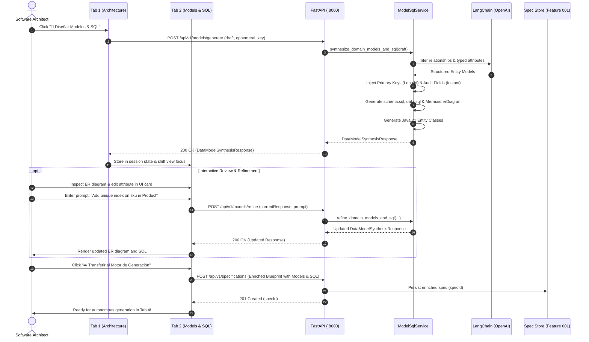

# Data Model & Interaction Flow: Domain Models & SQL Schema Generation

**Feature**: `004-domain-models-sql`  
**Date**: 2026-09-13  
**Status**: Approved  

---

## 1. Pydantic Domain Schemas (`backend/app/models/domain_model.py`)

### Enumerations

```python
class SqlDataType(str, Enum):
    BIGINT = "BIGINT"
    INTEGER = "INTEGER"
    VARCHAR = "VARCHAR"
    TEXT = "TEXT"
    NUMERIC = "NUMERIC"
    BOOLEAN = "BOOLEAN"
    TIMESTAMP_TZ = "TIMESTAMP WITH TIME ZONE"
    UUID = "UUID"
    DATE = "DATE"

class JavaPropertyType(str, Enum):
    LONG = "Long"
    INTEGER = "Integer"
    STRING = "String"
    BIG_DECIMAL = "BigDecimal"
    BOOLEAN = "Boolean"
    INSTANT = "Instant"
    UUID = "UUID"
    LOCAL_DATE = "LocalDate"

class RelationshipType(str, Enum):
    ONE_TO_MANY = "ONE_TO_MANY"
    MANY_TO_ONE = "MANY_TO_ONE"
    ONE_TO_ONE = "ONE_TO_ONE"
    MANY_TO_MANY = "MANY_TO_MANY"
```

### Core Data Models

```python
class EntityAttributeDefinition(BaseModel):
    name: str = Field(..., description="Java property name (camelCase, e.g. 'orderNumber')")
    columnName: str = Field(..., description="SQL column name (snake_case, e.g. 'order_number')")
    javaType: JavaPropertyType = Field(..., description="Target Java property type")
    sqlType: SqlDataType = Field(..., description="Target relational SQL type")
    length: Optional[int] = Field(default=None, description="Length for VARCHAR/CHAR types")
    nullable: bool = Field(default=False, description="Whether the column permits NULL")
    isPrimaryKey: bool = Field(default=False, description="True if primary key")
    isUnique: bool = Field(default=False, description="True if unique constraint applies")
    hasIndex: bool = Field(default=False, description="True if index should be generated")
    defaultValue: Optional[str] = Field(default=None, description="Default SQL expression")

class EntityRelationshipDefinition(BaseModel):
    sourceEntity: str = Field(..., description="Owning entity name (e.g. 'OrderItem')")
    targetEntity: str = Field(..., description="Target entity name (e.g. 'Order')")
    relationshipType: RelationshipType = Field(..., description="Cardinality mapping")
    joinColumnName: Optional[str] = Field(default=None, description="Foreign key column name (e.g. 'order_id')")
    inversePropertyName: Optional[str] = Field(default=None, description="Property name in inverse entity (e.g. 'items')")
    cascadeType: str = Field(default="ALL", description="JPA cascade strategy (ALL, PERSIST, MERGE)")
    fetchType: str = Field(default="LAZY", description="Fetch strategy (LAZY or EAGER)")

class DomainEntityDefinition(BaseModel):
    name: str = Field(..., description="Java Entity class name (PascalCase, e.g. 'Order')")
    tableName: str = Field(..., description="SQL table name (snake_case, plural, e.g. 'orders')")
    packageName: str = Field(..., description="Target Java package")
    attributes: List[EntityAttributeDefinition] = Field(default_factory=list)
    relationships: List[EntityRelationshipDefinition] = Field(default_factory=list)
    hasAuditFields: bool = Field(default=True, description="Includes createdAt and updatedAt")

class SqlSchemaScript(BaseModel):
    schemaDdl: str = Field(..., description="Complete executable schema.sql script")
    seedDml: str = Field(..., description="Complete executable data.sql script")
    tableNames: List[str] = Field(default_factory=list)
    dialect: str = Field(default="postgresql_h2")

class ModelSqlGenerationRequest(BaseModel):
    draft: SpecificationDraft = Field(..., description="Active requirements draft or blueprint")
    apiKey: Optional[str] = Field(default=None, description="Ephemeral OpenAI API Key")

class ModelSqlRefinementRequest(BaseModel):
    currentResponse: "DataModelSynthesisResponse" = Field(..., description="Current synthesis payload")
    feedbackPrompt: str = Field(..., min_length=3, description="Natural language adjustment prompt")
    targetEntity: Optional[str] = Field(default=None, description="Specific target entity or None for global")
    apiKey: Optional[str] = Field(default=None, description="Ephemeral OpenAI API Key")

class DataModelSynthesisResponse(BaseModel):
    serviceName: str
    packageName: str
    entities: List[DomainEntityDefinition]
    sqlSchema: SqlSchemaScript
    mermaidErDiagram: str
    javaEntityClasses: Dict[str, str] = Field(default_factory=dict, description="Entity name -> Java code")
    validationErrors: List[str] = Field(default_factory=list)
```

---

## 2. Sequence Diagram: Data Model Synthesis & Pipeline Handoff



