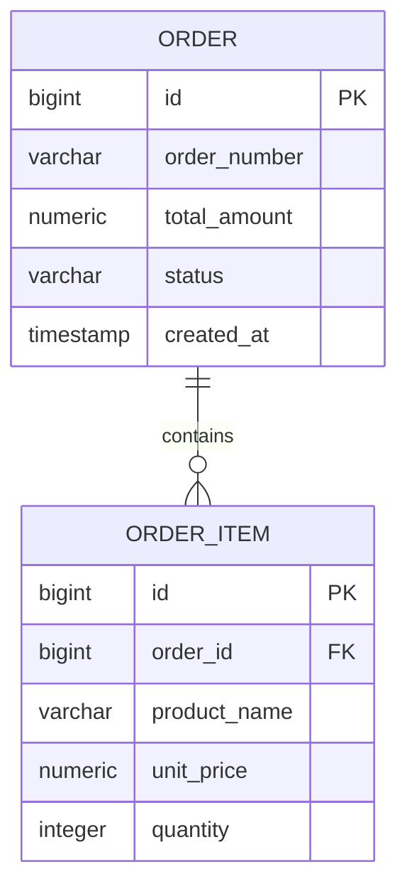

# Technical Research & Architecture Decisions: Domain Models & SQL Schema Generation

**Feature**: `004-domain-models-sql`  
**Date**: 2026-09-13  
**Status**: Approved  

---

## 1. SQL Dialect, DDL Structure & Hermetic Database Compatibility

### Decision
Generate standard Spring Boot DDL (`schema.sql`) and DML (`data.sql`) adhering to ANSI/PostgreSQL syntax fully compatible with H2 in PostgreSQL mode (`jdbc:h2:mem:testdb;MODE=PostgreSQL;DATABASE_TO_LOWER=TRUE;DEFAULT_NULL_ORDERING=HIGH`).

### Rationale
- Spring Boot 3 automatically discovers and executes `schema.sql` and `data.sql` during datasource initialization if configured via `spring.sql.init.mode=always`.
- H2 running with `MODE=PostgreSQL` natively executes standard PostgreSQL DDL (`BIGINT GENERATED BY DEFAULT AS IDENTITY`, `VARCHAR`, `NUMERIC`, `TIMESTAMP WITH TIME ZONE`).
- Enables 100% offline hermetic test execution in Docker sandbox (`mvn test -o --network none`) without requiring an external database daemon during integration test verification (Constitution Principle IV).

### Alternatives Considered
- **Flyway Migrations (`V1__init.sql`)**: Excellent for continuous deployment, but adds plugin configuration overhead during offline tests if Flyway schemas do not match H2 in-memory quirks.
- **Liquibase XML/YAML Changelogs**: Powerful, but verbose and harder for users to inspect directly in visual UI cards compared to raw clean SQL.
- **Hibernate Auto-DDL (`ddl-auto=update` / `create-drop`)**: Prohibited in enterprise environments due to unverified runtime schema alterations. Generating explicit, versionable `schema.sql` gives architects full deterministic control.

---

## 2. JPA Entity Mapping & Primary Key Strategy

### Decision
Model primary keys uniformly as numeric 64-bit integers: `Long id` annotated with `@Id` and `@GeneratedValue(strategy = GenerationType.IDENTITY)`, mapping to relational columns defined as `BIGINT GENERATED BY DEFAULT AS IDENTITY PRIMARY KEY`.

### Rationale
- Confirmed during user clarification session (Session 2026-09-13, Option A).
- Supported identically in PostgreSQL and H2.
- Avoids sequence allocation gaps in mock testing and simplifies foreign key definitions across child tables.
- Guarantees seamless integration with Spring Data JPA (`JpaRepository<T, Long>`).

### Alternatives Considered
- **UUID (`GenerationType.UUID`)**: High distributed scalability, but larger index footprint and slightly more complex test assertions.
- **Custom Hi/Lo or Sequence Generators**: Creates database-specific sequence dependencies that can fail in cross-dialect testing.

---

## 3. Entity Relationships & Foreign Key Dependency Ordering

### Decision
Infer relationships automatically from domain story context and aggregate descriptions:
- 1:N / N:1 associations mapped via JPA `@ManyToOne` (with `@JoinColumn(name = "parent_id", nullable = false)`) on the owning side and `@OneToMany(mappedBy = "parent", cascade = CascadeType.ALL, orphanRemoval = true)` on the inverse collection side.
- Relational foreign keys created with explicit constraint naming (`fk_{child}_{parent}`) and declared after table creation or in topological order to prevent circular creation deadlocks.

### Rationale
- Preserves referential integrity in both the relational database and the in-memory object graph.
- Prevents N+1 queries by recommending `FetchType.LAZY` on `@ManyToOne` associations.
- Topological sorting ensures parent tables (`orders`) are created before child tables (`order_items`).

### Alternatives Considered
- **Unconstrained Flat Models**: Eliminates foreign keys, but violates relational integrity and risks orphaned child rows.
- **Bidirectional `@ManyToMany` without join entity**: Often creates maintenance issues; resolving many-to-many through explicit join tables (`order_tags`) ensures indexability and payload expansion.

---

## 4. Audit Metadata Handling

### Decision
Automatically incorporate standard temporal audit fields into every domain entity and SQL table:
- Java: `Instant createdAt` and `Instant updatedAt` annotated with `@Column(name = "created_at", nullable = false, updatable = false)` and `@Column(name = "updated_at", nullable = false)`.
- SQL DDL: `created_at TIMESTAMP WITH TIME ZONE NOT NULL DEFAULT CURRENT_TIMESTAMP` and `updated_at TIMESTAMP WITH TIME ZONE NOT NULL DEFAULT CURRENT_TIMESTAMP`.

### Rationale
- Confirmed during user clarification session (Session 2026-09-13, Option A).
- Meets enterprise compliance requirements for record traceability.
- Works deterministically in PostgreSQL and H2 without requiring external clock synchronization.

### Alternatives Considered
- **No Audit Fields**: Leaves entities without creation timestamps, requiring retrofitting later.
- **Full Envers / History Tables**: Overkill for standard microservices; simple timestamp auditing provides 95% of required auditability with zero dependency overhead.

---

## 5. Live Visual Diagramming: Mermaid `erDiagram`

### Decision
Synthesize visual entity-relationship diagrams using Mermaid's standard `erDiagram` syntax:


### Rationale
- Native rendering in modern Streamlit via `st.markdown("```mermaid ... ```")`.
- Clean visual distinction between entities, attributes, primary keys (`PK`), foreign keys (`FK`), and cardinalities (`||--o{` 1 to many, `||--||` 1 to 1).
- Generates directly from `DomainEntityDefinition` and `EntityRelationshipDefinition` structures.

---

## 6. Security & Ephemeral API Key Resolution

### Decision
Follow Constitution Principle VI strictly:
- API keys provided through in-memory Streamlit session state and forwarded via `X-LLM-API-Key` HTTP header or payload `apiKey`.
- Endpoints return `401 Unauthorized` if no key is provided and offline mock fallback is not enabled.
- Zero secrets or API keys are written to disk, SQLite, logs, or repository files.

