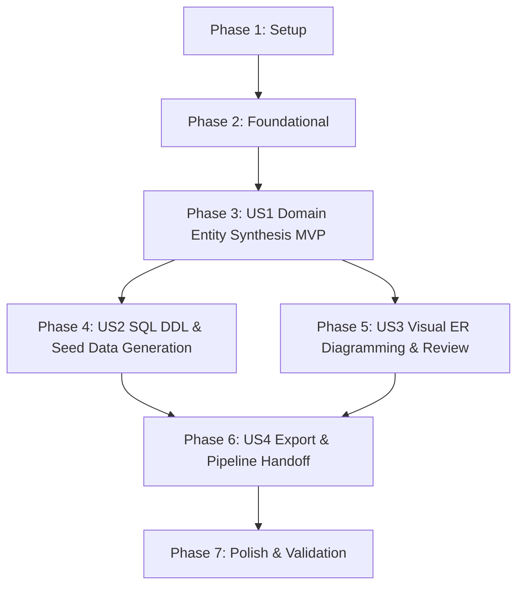

# Tasks: Automated Domain Models & SQL Schema Generation

**Branch**: `004-domain-models-sql` | **Date**: 2026-09-13 | **Spec**: [spec.md](./spec.md) | **Plan**: [plan.md](./plan.md)

---

## Phase 1: Setup (Shared Infrastructure)

**Purpose**: Project initialization and dependencies setup for domain model and SQL synthesis.

- [X] T001 Verify backend dependencies (`fastapi>=0.111.0`, `pydantic>=2.7.0`, `langchain-openai>=0.1.0`, `pyyaml>=6.0.0`) in `backend/requirements.txt`
- [X] T002 [P] Export domain model schemas in `backend/app/models/__init__.py`

---

## Phase 2: Foundational (Blocking Prerequisites)

**Purpose**: Core data schemas, serializers, API routing, and security guards that MUST be complete before ANY user story can be implemented.

**⚠️ CRITICAL**: No user story work can begin until this phase is complete.

- [X] T003 Implement Pydantic data schemas in `backend/app/models/domain_model.py`: `SqlDataType`, `JavaPropertyType`, `RelationshipType`, `EntityAttributeDefinition`, `EntityRelationshipDefinition`, `DomainEntityDefinition`, `SqlSchemaScript`, `ModelSqlGenerationRequest`, `ModelSqlRefinementRequest`, and `DataModelSynthesisResponse`
- [X] T004 [P] Implement Mermaid `erDiagram` generator helper in `backend/app/services/model_sql_service.py` to produce directional entity-relationship diagrams (`erDiagram`) with attributes and cardinalities
- [X] T005 [P] Implement ANSI/PostgreSQL SQL DDL and seed DML generator helpers in `backend/app/services/model_sql_service.py` (`generate_schema_sql`, `generate_seed_data_sql`) compatible with H2 `MODE=PostgreSQL`
- [X] T006 Mount models and SQL router under `/api/v1/models` in `backend/app/main.py`

**Checkpoint**: Foundation ready - request/response schemas, serializers, and routing operational.

---

## Phase 3: User Story 1 - Automated Domain Entity Model Synthesis (Priority: P1) 🎯 MVP

**Goal**: Automatically synthesize JPA domain entity models with strongly typed fields, numeric identity primary keys (`Long id`), audit timestamps (`Instant createdAt`, `updatedAt`), and Jakarta persistence annotations (`@Entity`, `@Table`, `@Id`, `@Column`) from a specification draft.

**Independent Test**: Submit a specification draft with domain entities (e.g. `Order`, `OrderItem`) to `POST /api/v1/models/generate` with an API key (or mock), verify HTTP 200 response with `entities` containing typed attributes, primary keys, and generated Java 21 entity classes.

### Tests for User Story 1

> **NOTE: Write these tests FIRST, ensure they FAIL before implementation**

- [X] T007 [P] [US1] Contract test for `POST /api/v1/models/generate` covering 200 success, 400 Bad Request on invalid draft, and 401 Unauthorized on missing API key in `backend/tests/test_routes_models_sql.py`
- [X] T008 [P] [US1] Unit test for entity model synthesis, primary key generation (`Long id`), and audit timestamps (`Instant createdAt`, `updatedAt`) in `backend/tests/test_model_sql_service.py`

### Implementation for User Story 1

- [X] T009 [US1] Implement LLM prompt template and structured extraction logic for domain entities, attributes, and relationships using `ChatOpenAI.with_structured_output` with deterministic offline fallback in `backend/app/services/model_sql_service.py`
- [X] T010 [US1] Implement Java 21 JPA entity source generator (`generate_java_entity_source`) with Jakarta Persistence annotations (`@Entity`, `@Table`, `@Id`, `@GeneratedValue(strategy = GenerationType.IDENTITY)`, `@Column`, `@CreatedDate`, `@LastModifiedDate`, and Lombok annotations) in `backend/app/services/model_sql_service.py`
- [X] T011 [US1] Implement `POST /api/v1/models/generate` endpoint with ephemeral API key resolution in `backend/app/api/routes_models_sql.py`
- [X] T012 [US1] Implement transition button "💾 Diseñar Modelos & SQL" in `frontend/views/architecture_view.py` (Tab 1) invoking `/api/v1/models/generate`, updating `st.session_state.data_model_design`, and shifting view focus to Tab 2

**Checkpoint**: User Story 1 functional and testable as an MVP increment.

---

## Phase 4: User Story 2 - Relational SQL DDL & Seed Data Generation (Priority: P1)

**Goal**: Generate standard relational SQL DDL scripts (`schema.sql`) and sample seed DML scripts (`data.sql`) matching the domain models, compatible with PostgreSQL and H2 in-memory mode.

**Independent Test**: Submit a draft with entities and acceptance scenarios, verify that `sqlSchema.schemaDdl` contains valid table creation statements with `BIGINT GENERATED BY DEFAULT AS IDENTITY`, foreign keys, indexes, and `sqlSchema.seedDml` contains valid `INSERT INTO` statements.

### Tests for User Story 2

- [X] T013 [P] [US2] Unit test for relational SQL DDL (`schema.sql`) and seed data (`data.sql`) generation, verifying H2/PostgreSQL syntax, primary keys, foreign keys, and unique indexes in `backend/tests/test_model_sql_service.py`

### Implementation for User Story 2

- [X] T014 [US2] Implement relational SQL generator enforcing `BIGINT GENERATED BY DEFAULT AS IDENTITY`, topological table ordering to prevent foreign key deadlocks, index creation, and Given-based seed `INSERT` statements in `backend/app/services/model_sql_service.py`
- [X] T015 [US2] Implement synchronized SQL script viewer with syntax highlighting and copy support in `frontend/views/models_sql_view.py`

**Checkpoint**: Domain models and SQL scripts derived and synchronized simultaneously.

---

## Phase 5: User Story 3 - Visual Entity-Relationship Diagram & Interactive Review (Priority: P2)

**Goal**: Render real-time Mermaid ER diagrams, interactive editable entity cards, and natural language AI refinement in the web studio.

**Independent Test**: Provide an existing data model synthesis response and feedback prompt (e.g. *"add a unique index on order_number and tracking_code in Order"*) to `POST /api/v1/models/refine`, verify HTTP 200 response with updated entity attributes, updated `schema.sql`, and updated Mermaid diagram.

### Tests for User Story 3

- [X] T016 [P] [US3] Contract test for `POST /api/v1/models/refine` with targeted and global feedback in `backend/tests/test_routes_models_sql.py`
- [X] T017 [P] [US3] Unit test for `refine_domain_models_and_sql` method updating entity definitions and synchronizing SQL DDL in `backend/tests/test_model_sql_service.py`

### Implementation for User Story 3

- [X] T018 [US3] Implement `refine_domain_models_and_sql` service method in `backend/app/services/model_sql_service.py`
- [X] T019 [US3] Implement `POST /api/v1/models/refine` endpoint in `backend/app/api/routes_models_sql.py`
- [X] T020 [US3] Implement live Mermaid `erDiagram` viewer, interactive editable entity cards (modifying column names, data types, nullability, unique toggles), and AI refinement chat in `frontend/views/models_sql_view.py`

**Checkpoint**: User Stories 1, 2, and 3 work together with full visual and interactive human-in-the-loop control.

---

## Phase 6: User Story 4 - Model & SQL Export and Pipeline Handoff (Priority: P3)

**Goal**: Export `schema.sql`, `data.sql`, and Java entity classes (.zip), and enable 1-click pipeline handoff to the autonomous code generator.

**Independent Test**: Download `schema.sql` and `data.sql` and verify valid non-empty content; click "Transferir al Motor de Generación" and verify enriched blueprint is saved into `SPECIFICATIONS_STORE`, `st.session_state.current_spec_id` is populated, and UI navigates to generation view.

### Tests for User Story 4

- [X] T021 [P] [US4] Integration test verifying conversion from `DataModelSynthesisResponse` to specification blueprint and saving into `POST /api/v1/specifications` in `backend/tests/test_routes_models_sql.py`

### Implementation for User Story 4

- [X] T022 [US4] Implement "📥 Descargar schema.sql", "📥 Descargar data.sql", and "📥 Descargar Clases Java Entity" buttons in `frontend/views/models_sql_view.py`
- [X] T023 [US4] Implement "➡️ Transferir al Motor de Generación" handoff button in `frontend/views/models_sql_view.py`, saving blueprint to `POST /api/v1/specifications` and setting `st.session_state.current_spec_id`

**Checkpoint**: End-to-end pipeline from user stories and architecture through domain models and SQL to code generation is complete.

---

## Phase 7: Polish & Cross-Cutting Concerns

**Purpose**: UI registration, quality hardening, end-to-end validation, and documentation.

- [X] T024 [P] Register Tab 2 ("💾 2. Modelos de Dominio & Esquema SQL") in `frontend/app.py` and adjust sequential tab ordering across the studio
- [X] T025 [P] Validate quickstart scenarios against running application per `specs/004-domain-models-sql/quickstart.md`
- [X] T026 Run full test suite (`python -m pytest backend/tests -o pythonpath=backend`) ensuring 100% pass across all existing and new tests
- [X] T027 [P] Update `README.md` with documentation for Tab 2 ("💾 2. Modelos de Dominio & Esquema SQL") and the Domain Models & SQL API endpoints

---

## Dependencies & Execution Order

### Phase Dependencies

- **Setup (Phase 1)**: No dependencies - can start immediately.
- **Foundational (Phase 2)**: Depends on Phase 1 completion - BLOCKS all user stories.
- **User Story 1 (Phase 3)**: Depends on Phase 2 - MVP milestone.
- **User Story 2 (Phase 4)**: Extends US1 with SQL DDL and seed DML derivation.
- **User Story 3 (Phase 5)**: Extends US1 and US2 with visual ER diagramming and interactive editing.
- **User Story 4 (Phase 6)**: Depends on Phases 3, 4, and 5 (export and handoff of complete data model).
- **Polish (Phase 7)**: Depends on all user stories being complete.

### User Story Dependencies

### Parallel Opportunities

- Within Phase 1: `T002` can run alongside `T001`.
- Within Phase 2: `T004` and `T005` can run in parallel after `T003`.
- Within Phase 3: Contract test `T007` and unit test `T008` can be written in parallel.
- Within Phase 5: `T016` and `T017` can be written in parallel.
- Within Phase 7: `T024`, `T025`, and `T027` can run in parallel.

---

## Implementation Strategy

### MVP First (User Story 1 Only)

1. Complete Phase 1 (Setup) and Phase 2 (Foundational).
2. Complete Phase 3 (User Story 1: Domain Entity Synthesis).
3. **STOP and VALIDATE**: Verify specification draft produces JPA entity models with `Long id` identity primary keys and audit fields.

### Incremental Delivery

1. Setup + Foundational -> Foundation ready.
2. US1 -> Domain Entity Models MVP works.
3. US2 -> PostgreSQL/H2 `schema.sql` and `data.sql` derived.
4. US3 -> Mermaid `erDiagram` viewer and interactive AI refinement work.
5. US4 -> SQL download, entity zip export, and direct handoff to Feature 001 work.
6. Polish -> Tab 2 registered, 100% test pass rate across all features, and updated documentation.

