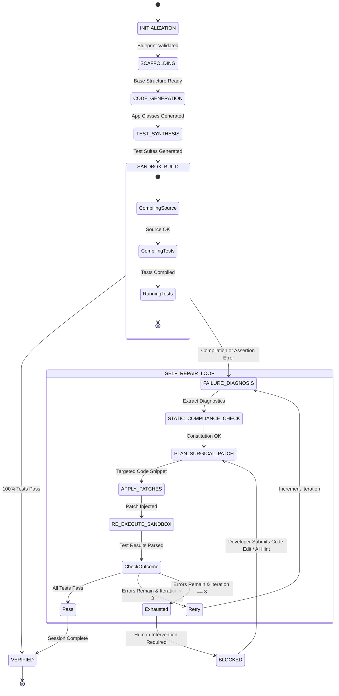
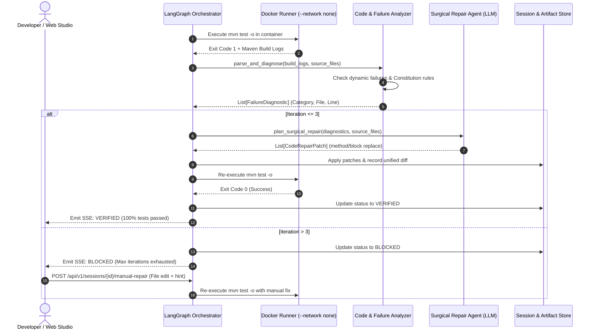

# Data Model: Automated Test Generation, Code Analysis & Iterative Self-Repair

**Feature**: `005-automated-tests-analysis`  
**Date**: 2026-09-13  
**Status**: Completed  

---

## 1. Entity Definitions & Schemas

### 1.1 Enums

```python
class TestType(str, Enum):
    UNIT = "UNIT"                         # Service unit test with Mockito
    INTEGRATION_WEB = "INTEGRATION_WEB"   # Controller @WebMvcTest
    INTEGRATION_DB = "INTEGRATION_DB"     # Full @SpringBootTest with H2 PostgreSQL mode

class DiagnosticCategory(str, Enum):
    COMPILATION_ERROR = "COMPILATION_ERROR"
    ASSERTION_FAILURE = "ASSERTION_FAILURE"
    CONSTITUTIONAL_VIOLATION = "CONSTITUTIONAL_VIOLATION"
    RUNTIME_EXCEPTION = "RUNTIME_EXCEPTION"

class DiagnosticSeverity(str, Enum):
    BLOCKING = "BLOCKING"
    HIGH = "HIGH"
    MEDIUM = "MEDIUM"
    LOW = "LOW"

class PatchType(str, Enum):
    METHOD_REPLACE = "METHOD_REPLACE"
    IMPORT_ADD = "IMPORT_ADD"
    STATEMENT_REPLACE = "STATEMENT_REPLACE"
    WHOLE_FILE = "WHOLE_FILE"

class RepairOutcome(str, Enum):
    SUCCESS = "SUCCESS"                   # 100% tests pass
    FAILED_CONTINUE = "FAILED_CONTINUE"   # Tests failed, attempts < 3
    FAILED_BLOCKED = "FAILED_BLOCKED"     # Tests failed, attempts == 3
```

---

### 1.2 Core Data Models

```python
class TestCaseDefinition(BaseModel):
    name: str = Field(..., description="Method name e.g. shouldCreateOrderSuccessfully")
    scenarioId: Optional[str] = Field(None, description="Mapped Given/When/Then scenario e.g. AC-1.1")
    testType: TestType
    targetMethod: str = Field(..., description="Method under test")
    description: str
    code: str = Field(..., description="Complete test method code including annotations")

class TestSuiteDefinition(BaseModel):
    className: str = Field(..., description="e.g. OrderServiceTest, OrderControllerTest")
    targetClassName: str = Field(..., description="e.g. OrderService, OrderController")
    packageName: str = Field(..., description="Package name e.g. com.example.orderservice.service")
    testType: TestType
    filePath: str = Field(..., description="Relative path e.g. src/test/java/com/example/.../OrderServiceTest.java")
    imports: List[str] = Field(default_factory=list)
    testCases: List[TestCaseDefinition] = Field(default_factory=list)
    fullSourceCode: str = Field(..., description="Runnable Java test class code")

class FailureDiagnostic(BaseModel):
    id: str = Field(..., description="Unique diagnostic ID e.g. DIAG-001")
    category: DiagnosticCategory
    severity: DiagnosticSeverity
    filePath: str = Field(..., description="Path to file causing failure")
    className: Optional[str] = None
    methodName: Optional[str] = None
    lineNumber: Optional[int] = None
    columnNumber: Optional[int] = None
    errorSummary: str = Field(..., description="High-level error summary")
    expectedValue: Optional[str] = None
    actualValue: Optional[str] = None
    rawStackTrace: str = Field(default="")
    suggestedFix: Optional[str] = None

class CodeRepairPatch(BaseModel):
    id: str = Field(..., description="Unique patch ID e.g. PATCH-001")
    filePath: str = Field(..., description="Target file path to modify")
    patchType: PatchType = Field(default=PatchType.METHOD_REPLACE)
    targetMethod: Optional[str] = None
    originalSnippet: str = Field(..., description="Exact code snippet to replace")
    replacementSnippet: str = Field(..., description="New replacement code snippet")
    explanation: str = Field(..., description="Rationale for the change")

class RepairIterationRecord(BaseModel):
    iterationNumber: int = Field(..., ge=1, le=3)
    diagnostics: List[FailureDiagnostic]
    patchesApplied: List[CodeRepairPatch]
    passedTestsBefore: int
    failedTestsBefore: int
    passedTestsAfter: int
    failedTestsAfter: int
    diffSummary: str = Field(..., description="Unified diff of all modifications in this iteration")
    durationSeconds: float
    outcome: RepairOutcome

class RepairHistoryResponse(BaseModel):
    sessionId: str
    totalIterations: int
    finalState: str
    iterations: List[RepairIterationRecord]
    canRetryManually: bool = False
    currentBlockedDiagnostic: Optional[FailureDiagnostic] = None
```

---

## 2. State Machine & Execution Flow



---

## 3. Sequence Diagram: Self-Repair Cycle



