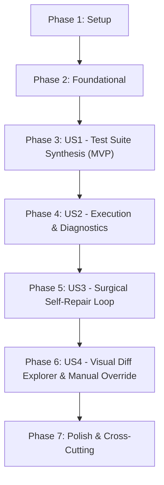

# Tasks: Automated Test Generation, Code Analysis & Iterative Self-Repair

**Branch**: `005-automated-tests-analysis` | **Date**: 2026-09-13 | **Spec**: [spec.md](./spec.md) | **Plan**: [plan.md](./plan.md)

---

## Phase 1: Setup (Shared Infrastructure)

**Purpose**: Project initialization and dependencies setup for test synthesis, code analysis, and self-repair.

- [X] T001 Verify backend dependencies (`fastapi>=0.111.0`, `pydantic>=2.7.0`, `langchain-openai>=0.1.0`) in `backend/requirements.txt`
- [X] T002 [P] Export test analysis and repair models in `backend/app/models/__init__.py`

---

## Phase 2: Foundational (Blocking Prerequisites)

**Purpose**: Core data schemas, static code analysis rules, diagnostic parsers, and API routing that MUST be complete before ANY user story can be implemented.

**⚠️ CRITICAL**: No user story work can begin until this phase is complete.

- [X] T003 Implement Pydantic data schemas in `backend/app/models/test_analysis.py`: `TestType`, `DiagnosticCategory`, `DiagnosticSeverity`, `PatchType`, `RepairOutcome`, `TestCaseDefinition`, `TestSuiteDefinition`, `FailureDiagnostic`, `CodeRepairPatch`, `RepairIterationRecord`, `RepairHistoryResponse`, `ManualRepairRequest`, and `ManualRepairResponse`
- [X] T004 [P] Implement static architectural compliance analyzer (`analyze_code_compliance`) in `backend/app/services/test_analysis_service.py` enforcing Constitution Principles I, II, III (4-layer unidirectional flow, Java Records for DTOs, `@RestControllerAdvice`, no JPA entity leakage)
- [X] T005 [P] Implement granular Maven and Surefire failure diagnostics parser in `backend/app/services/repair_parser.py` extracting file path, line number, category (`COMPILATION_ERROR`, `ASSERTION_FAILURE`), expected vs. actual values, and stack traces
- [X] T006 Mount test analysis and self-repair router under `/api/v1/tests` in `backend/app/main.py`

**Checkpoint**: Foundation ready - schemas, static analyzers, log parsers, and routing operational.

---

## Phase 3: User Story 1 - Comprehensive Test Suite Synthesis (Priority: P1) 🎯 MVP

**Goal**: Automatically synthesize runnable hybrid test suites: isolated unit tests with Mockito for service and controller layers, and `@SpringBootTest` integration tests with in-memory H2 database (`MODE=PostgreSQL`) derived from Given/When/Then acceptance criteria.

**Independent Test**: Provide a specification draft, call `POST /api/v1/tests/synthesize`, verify HTTP 200 with service unit tests, controller web tests, and repository integration tests matching Given/When/Then scenarios.

### Tests for User Story 1

> **NOTE: Write these tests FIRST, ensure they FAIL before implementation**

- [X] T007 [P] [US1] Contract test for `POST /api/v1/tests/synthesize` covering 200 success, 400 Bad Request on invalid blueprint, and 401 Unauthorized in `backend/tests/test_routes_tests.py`
- [X] T008 [P] [US1] Unit test for test suite synthesis (`synthesize_test_suites`) generating Mockito unit tests, `@WebMvcTest` controller tests, and `@SpringBootTest` integration tests in `backend/tests/test_test_analysis_service.py`

### Implementation for User Story 1

- [X] T009 [US1] Implement test suite generator (`synthesize_test_suites`) with deterministic template synthesis and LLM-assisted generation (`ChatOpenAI.with_structured_output`) in `backend/app/services/test_analysis_service.py`
- [X] T010 [US1] Implement `POST /api/v1/tests/synthesize` endpoint with ephemeral API key resolution in `backend/app/api/routes_tests.py`
- [X] T011 [US1] Integrate test synthesis step into the autonomous session generation pipeline in `backend/app/api/routes_session.py` (transitioning `CODE_GENERATION` → `TEST_SYNTHESIS`)

**Checkpoint**: User Story 1 functional and testable as an MVP increment.

---

## Phase 4: User Story 2 - Hermetic Test Execution & Failure Diagnostics (Priority: P1)

**Goal**: Execute test suites inside the isolated Docker sandbox (`--network none`, `mvn test -o`) and transform raw terminal output into structured `FailureDiagnostic` reports.

**Independent Test**: Run a test suite containing intentional syntax or assertion errors, verify that `POST /api/v1/tests/analyze` returns structured diagnostics with exact file paths, line numbers, error categories, and error summaries.

### Tests for User Story 2

- [X] T012 [P] [US2] Contract test for `POST /api/v1/tests/analyze` verifying diagnostics extraction from compilation errors and assertion failures in `backend/tests/test_routes_tests.py`
- [X] T013 [P] [US2] Unit test for log parsing and constitutional static checks in `backend/tests/test_test_analysis_service.py`

### Implementation for User Story 2

- [X] T014 [US2] Implement `analyze_execution_and_code` in `backend/app/services/test_analysis_service.py` combining dynamic Surefire reports with `analyze_code_compliance` static rules
- [X] T015 [US2] Implement `POST /api/v1/tests/analyze` endpoint in `backend/app/api/routes_tests.py`

**Checkpoint**: Test execution failures structured into actionable diagnostics.

---

## Phase 5: User Story 3 - Autonomous Code Self-Repair Loop (Priority: P1)

**Goal**: Plan and apply surgical method/block code modifications to repair detected failures, re-execute tests, and enforce the constitutional hard cap of 3 iterations before transitioning to `VERIFIED` or `BLOCKED`.

**Independent Test**: Provide an invalid source file with diagnostics, call `POST /api/v1/tests/repair`, verify surgical `CodeRepairPatch` generation, re-execution in sandbox, iteration incrementing, and proper transition to `BLOCKED` after iteration 3.

### Tests for User Story 3

- [X] T016 [P] [US3] Contract test for `POST /api/v1/tests/repair` covering iteration planning, re-test execution, and 3-attempt limit in `backend/tests/test_routes_tests.py`
- [X] T017 [P] [US3] Unit test for surgical method/block repair patching (`plan_surgical_repair`, `apply_patch`) without full file rewriting in `backend/tests/test_test_analysis_service.py`

### Implementation for User Story 3

- [X] T018 [US3] Implement surgical patch planner and code patcher (`plan_surgical_repair`, `apply_code_patch`) at method/block level in `backend/app/services/test_analysis_service.py`
- [X] T019 [US3] Implement autonomous self-repair iteration loop (`execute_repair_iteration`) with iteration counter, duration tracking, and unified diff computation in `backend/app/services/test_analysis_service.py`
- [X] T020 [US3] Implement `POST /api/v1/tests/repair` endpoint and `GET /api/v1/sessions/{sessionId}/repairs` endpoint in `backend/app/api/routes_tests.py`
- [X] T021 [US3] Integrate self-repair loop into `backend/app/api/routes_session.py` orchestrator streaming `SELF_REPAIR_LOOP` events with iteration badges and diff summaries over SSE

**Checkpoint**: Autonomous self-repair loop operational with 3-attempt constitutional boundary.

---

## Phase 6: User Story 4 - Visual Test Explorer, Diagnostics & Repair Diff Viewer (Priority: P2)

**Goal**: Render an interactive dashboard in Streamlit Tab 5 with test suite hierarchy, failure diagnostics, side-by-side/unified repair diffs across iterations 1..3, and an in-browser code editor with AI assistance to resolve `BLOCKED` sessions.

**Independent Test**: Navigate to Tab 5 in Streamlit for a session with repair iterations, view the test tree, toggle iteration diffs, and on a blocked session, submit a manual edit via `POST /api/v1/sessions/{id}/manual-repair` and verify unblocking.

### Tests for User Story 4

- [X] T022 [P] [US4] Contract test for `POST /api/v1/sessions/{sessionId}/manual-repair` validating manual code edits, hint ingestion, and re-running the sandbox in `backend/tests/test_routes_tests.py`

### Implementation for User Story 4

- [X] T023 [US4] Implement `POST /api/v1/sessions/{sessionId}/manual-repair` endpoint in `backend/app/api/routes_tests.py`
- [X] T024 [US4] Update `frontend/views/monitor_view.py` (Tab 4) with phase indicators for `TEST_SYNTHESIS` and `SELF_REPAIR_LOOP` (Iteration 1/3, 2/3, 3/3) and `BLOCKED` warning banner
- [X] T025 [US4] Implement Test Suite Tree Explorer, Failure Diagnostics Cards, and Unified Repair Diff Viewer in `frontend/views/explorer_view.py` (Tab 5)
- [X] T026 [US4] Implement in-browser manual code editor with AI assistance and `"🔄 Aplicar Corrección y Reintentar"` button in `frontend/views/explorer_view.py` (Tab 5) for `BLOCKED` sessions

**Checkpoint**: End-to-end human-in-the-loop observability and manual unblocking operational.

---

## Phase 7: Polish & Cross-Cutting Concerns

**Purpose**: Quality hardening, end-to-end validation, test suite regression check, and documentation.

- [X] T027 [P] Validate end-to-end quickstart scenarios per `specs/005-automated-tests-analysis/quickstart.md`
- [X] T028 Run full test suite (`python -m pytest backend/tests -o pythonpath=backend`) ensuring 100% pass across all existing and new tests
- [X] T029 [P] Update `README.md` with documentation for Test Synthesis, Static/Dynamic Analysis, Self-Repair loop, and the `/api/v1/tests/*` endpoints

---

## Dependencies & Execution Order

### Phase Dependencies

- **Setup (Phase 1)**: No dependencies - can start immediately.
- **Foundational (Phase 2)**: Depends on Phase 1 completion - BLOCKS all user stories.
- **User Story 1 (Phase 3)**: Depends on Phase 2 - MVP milestone.
- **User Story 2 (Phase 4)**: Extends US1 with sandbox execution and failure diagnostics.
- **User Story 3 (Phase 5)**: Extends US2 with autonomous surgical self-repair loop.
- **User Story 4 (Phase 6)**: Depends on Phases 3, 4, and 5 (UI visualization, diff viewer, manual override).
- **Polish (Phase 7)**: Depends on all user stories being complete.

### User Story Dependencies

---

## Parallel Opportunities

- In Phase 1: `T002` can proceed in parallel.
- In Phase 2: `T004` and `T005` can be developed in parallel once `T003` (models) is ready.
- In Phase 3: Contract tests `T007` and unit tests `T008` can be written in parallel.
- In Phase 4: `T012` and `T013` can be written in parallel.
- In Phase 5: `T016` and `T017` can be written in parallel.
- In Phase 6: `T022` test can be written in parallel with frontend preparations.
- In Phase 7: `T027` and `T029` can proceed in parallel.

---

## Implementation Strategy

### MVP First (User Story 1 Only)

1. Complete Phase 1: Setup (`T001`, `T002`).
2. Complete Phase 2: Foundational (`T003`–`T006`).
3. Complete Phase 3: User Story 1 (`T007`–`T011`).
4. **STOP and VALIDATE**: Test User Story 1 independently with `POST /api/v1/tests/synthesize`.

### Incremental Delivery

1. Setup + Foundation: Core Pydantic schemas, static analyzer, Surefire parser.
2. User Story 1 (MVP): Automatic synthesis of hybrid Mockito and `@SpringBootTest` test suites.
3. User Story 2: Offline sandbox execution and structured failure diagnostics extraction.
4. User Story 3: Surgical method/block self-repair loop bounded by 3 iterations.
5. User Story 4: Streamlit live badges, unified diff viewer, and manual code editor for blocked sessions.
6. Polish: Full test suite pass (100%), documentation in `README.md`.

