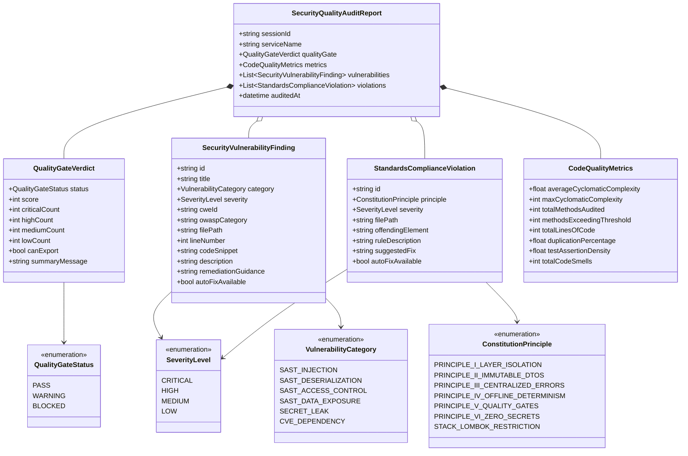
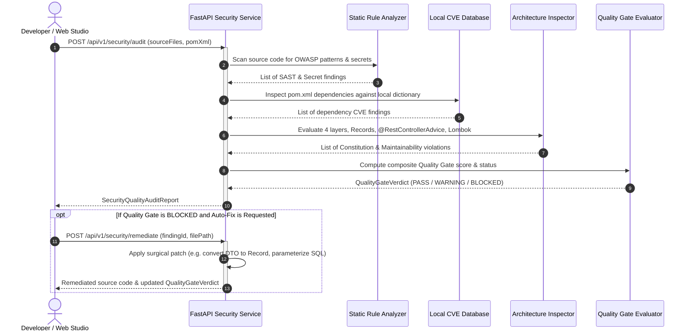

# Data Model: Security Vulnerability Auditing & Code Quality Standards

**Feature**: `006-security-quality-audit`  
**Date**: 2026-09-13  
**Status**: Completed  

---

## 1. Domain Entities & Schemas



---

## 2. JSON Schema Definitions

### 2.1 `QualityGateVerdict`
Represents the overarching security and quality decision governing whether code is allowed to be exported or published.

```json
{
  "status": "BLOCKED",
  "score": 68,
  "criticalCount": 1,
  "highCount": 1,
  "mediumCount": 2,
  "lowCount": 0,
  "canExport": false,
  "summaryMessage": "Quality Gate BLOCKED: 1 Critical secret leak and 1 High SQL injection risk detected."
}
```

### 2.2 `SecurityVulnerabilityFinding`
Represents an actionable security defect identified in source code or dependencies.

```json
{
  "id": "SEC-VULN-001",
  "title": "SQL Injection in Repository Query",
  "category": "SAST_INJECTION",
  "severity": "HIGH",
  "cweId": "CWE-89",
  "owaspCategory": "A03:2021-Injection",
  "filePath": "src/main/java/com/corp/order/repository/OrderRepository.java",
  "lineNumber": 18,
  "codeSnippet": "@Query(\"SELECT o FROM Order o WHERE o.customer = '\" + customerName + \"'\")",
  "description": "Dynamic string concatenation in Spring Data @Query enables SQL/JPQL injection attacks.",
  "remediationGuidance": "Use parameterized queries: @Query(\"SELECT o FROM Order o WHERE o.customer = :customerName\")",
  "autoFixAvailable": true
}
```

### 2.3 `StandardsComplianceViolation`
Represents a breach of constitutional guidelines, Clean Code principles, or architectural rules.

```json
{
  "id": "CONST-VIOL-001",
  "principle": "PRINCIPLE_II_IMMUTABLE_DTOS",
  "severity": "HIGH",
  "filePath": "src/main/java/com/corp/order/dto/CreateOrderRequest.java",
  "offendingElement": "public class CreateOrderRequest",
  "ruleDescription": "Constitution Principle II Violation: Request DTOs MUST be immutable Java Records with Jakarta validation.",
  "suggestedFix": "Convert class to public record CreateOrderRequest(@NotBlank String customerEmail, @NotNull BigDecimal totalAmount)",
  "autoFixAvailable": true
}
```

### 2.4 `CodeQualityMetrics`
Captures structural maintainability metrics across all compiled or generated classes.

```json
{
  "averageCyclomaticComplexity": 2.4,
  "maxCyclomaticComplexity": 14,
  "totalMethodsAudited": 28,
  "methodsExceedingThreshold": 1,
  "totalLinesOfCode": 450,
  "duplicationPercentage": 1.2,
  "testAssertionDensity": 2.8,
  "totalCodeSmells": 2
}
```

---

## 3. Interaction & Lifecycle Flow



