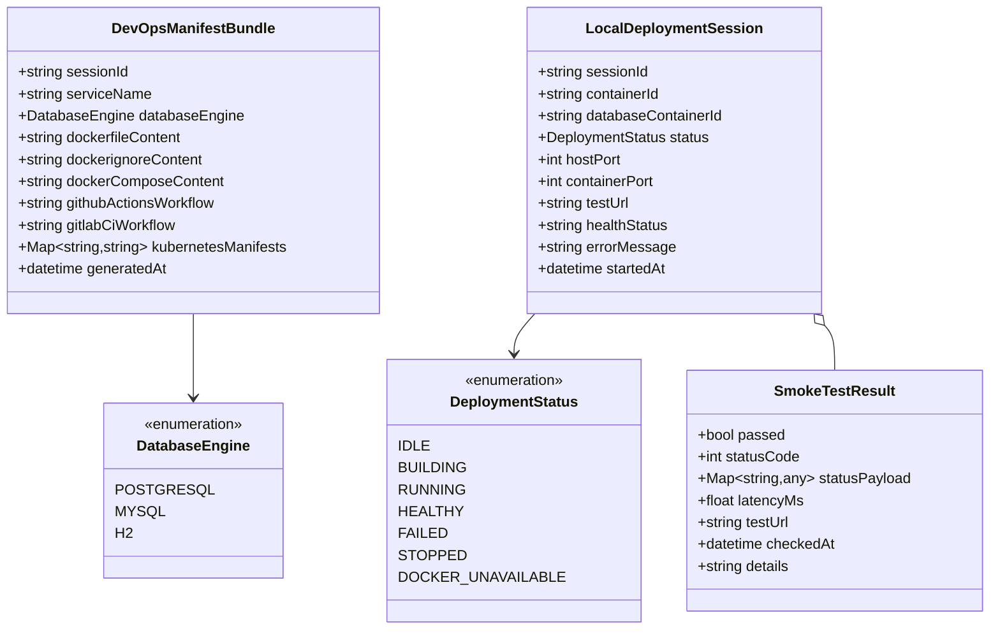
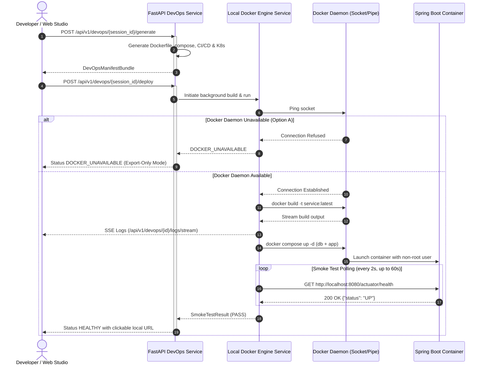

# Data Model: Docker Containerization, CI/CD Pipelines & Deployment Orchestration

**Feature**: `007-docker-cicd-orchestration`  
**Date**: 2026-09-13  
**Status**: Completed  

---

## 1. Domain Entities & Schemas



---

## 2. JSON Schema Definitions

### 2.1 `DevOpsManifestBundle`
Represents the complete generated suite of containerization, orchestration, pipeline, and production deployment assets for a microservice.

```json
{
  "sessionId": "session-12345",
  "serviceName": "order-service",
  "databaseEngine": "POSTGRESQL",
  "dockerfileContent": "FROM eclipse-temurin:21-jre-alpine AS builder ...",
  "dockerignoreContent": ".git\ntarget/\n*.log\n",
  "dockerComposeContent": "version: '3.8'\nservices:\n  order-service:\n    build: .\n    ports:\n      - \"8080:8080\"\n...",
  "githubActionsWorkflow": "name: CI/CD Pipeline\non: [push, pull_request] ...",
  "gitlabCiWorkflow": "stages:\n  - build\n  - test\n  - security\n  - package ...",
  "kubernetesManifests": {
    "deployment.yaml": "apiVersion: apps/v1\nkind: Deployment ...",
    "service.yaml": "apiVersion: v1\nkind: Service ...",
    "configmap.yaml": "apiVersion: v1\nkind: ConfigMap ...",
    "ingress.yaml": "apiVersion: networking.k8s.io/v1\nkind: Ingress\nspec:\n  ingressClassName: nginx ..."
  },
  "generatedAt": "2026-09-13T21:00:00Z"
}
```

### 2.2 `LocalDeploymentSession`
Tracks the execution lifecycle of local Docker containers launched from the Web Studio.

```json
{
  "sessionId": "session-12345",
  "containerId": "a1b2c3d4e5f6",
  "databaseContainerId": "f6e5d4c3b2a1",
  "status": "HEALTHY",
  "hostPort": 8080,
  "containerPort": 8080,
  "testUrl": "http://localhost:8080/actuator/health",
  "healthStatus": "UP",
  "errorMessage": null,
  "startedAt": "2026-09-13T21:02:15Z"
}
```

### 2.3 `SmokeTestResult`
Captures the output of automated post-deployment health verification.

```json
{
  "passed": true,
  "statusCode": 200,
  "statusPayload": {
    "status": "UP",
    "components": {
      "db": {"status": "UP"},
      "diskSpace": {"status": "UP"}
    }
  },
  "latencyMs": 42.5,
  "testUrl": "http://localhost:8080/actuator/health",
  "checkedAt": "2026-09-13T21:02:45Z",
  "details": "Application is UP and responding normally."
}
```

---

## 3. Interaction & Deployment Lifecycle Flow



