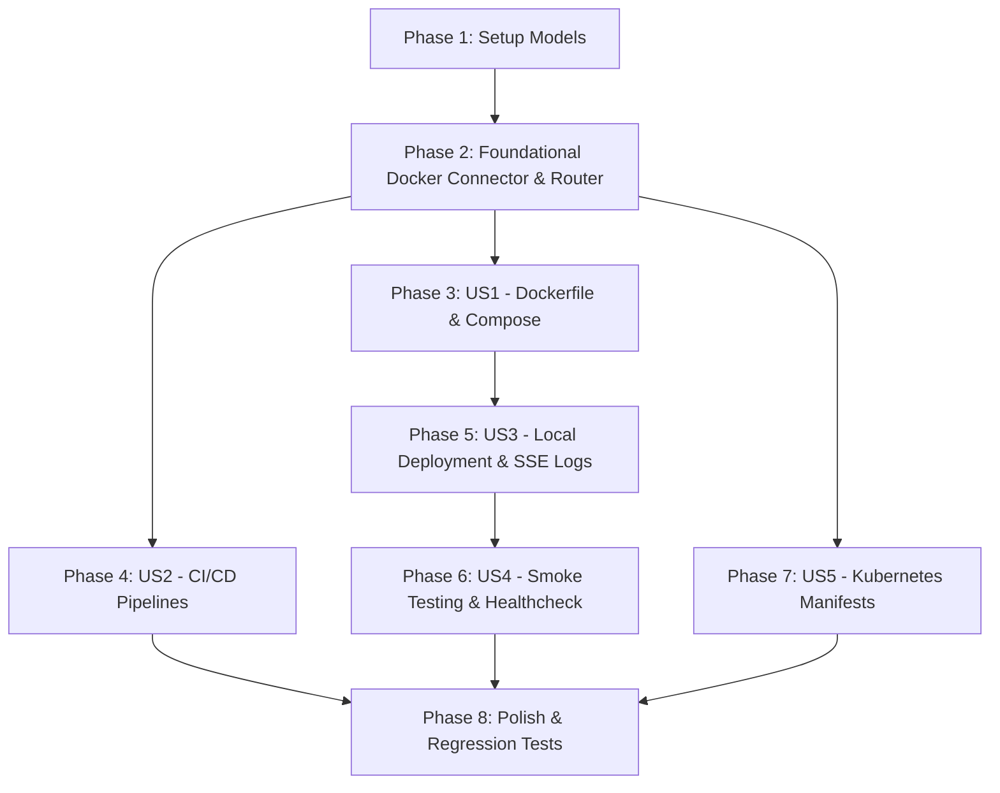

# Tasks: Docker Containerization, CI/CD Pipelines & Deployment Orchestration

**Branch**: `007-docker-cicd-orchestration` | **Date**: 2026-09-13 | **Spec**: [specs/007-docker-cicd-orchestration/spec.md](file:///c:/Users/willi/Downloads/agentIA/specs/007-docker-cicd-orchestration/spec.md) | **Plan**: [specs/007-docker-cicd-orchestration/plan.md](file:///c:/Users/willi/Downloads/agentIA/specs/007-docker-cicd-orchestration/plan.md)

---

## Phase 1: Setup (Shared Infrastructure)

**Purpose**: Establish DevOps domain models, enums, and generator infrastructure.

- [X] T001 Create DevOps domain models and enums in `backend/app/models/devops.py` with `DeploymentStatus` (`IDLE`, `BUILDING`, `RUNNING`, `HEALTHY`, `FAILED`, `STOPPED`, `DOCKER_UNAVAILABLE`), `DatabaseEngine` (`POSTGRESQL`, `MYSQL`, `H2`), `DevOpsManifestBundle`, `LocalDeploymentSession`, `SmokeTestResult`, and `DevOpsDeployRequest`
- [X] T002 [P] Setup DevOps generator service skeleton in `backend/app/services/devops_service.py` with file writing utilities and template renderers

---

## Phase 2: Foundational (Blocking Prerequisites)

**Purpose**: Docker daemon connector, execution queue, and API routing structure that all user stories depend on.

- [X] T003 Implement Docker daemon connector, process execution queue, and log streaming buffer in `backend/app/services/docker_service.py` with `check_docker_daemon`
- [X] T004 [P] Create FastAPI DevOps router in `backend/app/api/routes_devops.py` and register it in `backend/app/main.py` under prefix `/api/v1`

---

## Phase 3: User Story 1 - Hermetic Multi-Stage Docker Containerization & Local Orchestration (Priority: P1) 🎯 MVP

**Goal**: Generate an optimized, multi-stage Dockerfile (Eclipse Temurin JRE 21, Spring Boot `layertools`, non-root user `appuser:10001`, JVM cgroup memory limits, and `.dockerignore`) and `docker-compose.yml` orchestrating the microservice with the target database (PostgreSQL/MySQL/H2) and persistent volume mounting `schema.sql`.

**Independent Test**: Generate container assets for a microservice and verify Dockerfile layers, unprivileged user execution, container memory limits, and compose database healthchecks.

### Tests for User Story 1
- [X] T005 [P] [US1] Unit tests for Dockerfile, .dockerignore, and docker-compose generation in `backend/tests/test_devops_service.py`

### Implementation for User Story 1
- [X] T006 [P] [US1] Implement `generate_dockerfile` and `generate_dockerignore` in `backend/app/services/devops_service.py` using Eclipse Temurin JRE 21, Spring Boot `layertools` layer extraction, non-root user `appuser:10001`, and `-XX:MaxRAMPercentage=75.0`
- [X] T007 [US1] Implement `generate_docker_compose` in `backend/app/services/devops_service.py` orchestrating the microservice with the target database (PostgreSQL 16, MySQL 8, or standalone H2), mounting `schema.sql` into `/docker-entrypoint-initdb.d/`, and configuring healthchecks and networks

**Checkpoint**: User Story 1 is fully functional — multi-stage Dockerfile and docker-compose.yml are generated reproducibly.

---

## Phase 4: User Story 2 - Automated Enterprise CI/CD Pipelines (Priority: P1)

**Goal**: Generate standardized CI/CD pipeline definitions for GitHub Actions and GitLab CI enforcing hermetic Maven builds, test execution (Spec 005), SAST & secret audits (Spec 006), Docker build, and Trivy CVE container scanning.

**Independent Test**: Generate pipeline definitions and verify all stages (build, test, security gate, docker build, Trivy scan) and secret references.

### Tests for User Story 2
- [X] T008 [P] [US2] Unit tests for GitHub Actions and GitLab CI pipeline generation in `backend/tests/test_devops_service.py`

### Implementation for User Story 2
- [X] T009 [P] [US2] Implement `generate_github_actions` in `backend/app/services/devops_service.py` (`.github/workflows/ci-cd.yml`) with Maven test, SAST/secrets quality gate check, Docker build, and Trivy scanning
- [X] T010 [US2] Implement `generate_gitlab_ci` in `backend/app/services/devops_service.py` (`.gitlab-ci.yml`) with equivalent stages

**Checkpoint**: User Stories 1 and 2 work independently, providing both containerization and automated CI/CD pipelines.

---

## Phase 5: User Story 3 - Local Deployment Engine with Live SSE Streaming Logs (Priority: P1)

**Goal**: Provide local container deployment connecting to the Docker daemon, streaming live build/run logs via Server-Sent Events (SSE) into a real-time terminal in the Web Studio, with a graceful "Export-Only" fallback if Docker is unavailable.

**Independent Test**: Trigger local deployment via API or Web Studio Tab 7, and verify live SSE log stream delivery and status tracking.

### Tests for User Story 3
- [X] T011 [P] [US3] Contract and integration tests for local deployment and SSE log streaming in `backend/tests/test_routes_devops.py`

### Implementation for User Story 3
- [X] T012 [US3] Implement Docker execution and log streaming in `backend/app/services/docker_service.py` (`deploy_local`, `stream_logs`, `get_deployment_status`, `stop_deployment`)
- [X] T013 [US3] Implement endpoints `POST /api/v1/devops/{session_id}/generate`, `POST /api/v1/devops/{session_id}/deploy`, `GET /api/v1/devops/{session_id}/status`, `GET /api/v1/devops/{session_id}/logs/stream`, and `POST /api/v1/devops/{session_id}/stop` in `backend/app/api/routes_devops.py` enforcing Quality Gate check
- [X] T014 [US3] Create Web Studio Tab 7 view in `frontend/views/devops_view.py` and integrate it into `frontend/app.py` with status badges, deployment buttons, and real-time terminal output

**Checkpoint**: User Stories 1, 2, and 3 are complete — local containerization, CI/CD, and live deployment are operational.

---

## Phase 6: User Story 4 - Automated Smoke Testing & Healthcheck Verification (Priority: P2)

**Goal**: Automatically poll `/actuator/health` post-deployment until confirming status `UP` (or 60s timeout), surface response latency, and expose clickable local test URLs in the Web Studio.

**Independent Test**: Trigger smoke test endpoint and verify latency measurement, status parsing, and test URL generation.

### Tests for User Story 4
- [X] T015 [P] [US4] Unit and contract tests for smoke test polling and healthcheck parsing in `backend/tests/test_devops_service.py` and `backend/tests/test_routes_devops.py`

### Implementation for User Story 4
- [X] T016 [US4] Implement `run_smoke_test` in `backend/app/services/docker_service.py` polling `/actuator/health` every 2s with timeout
- [X] T017 [US4] Implement `POST /api/v1/devops/{session_id}/smoke-test` in `backend/app/api/routes_devops.py` and add Smoke Test trigger & test URL badge to `frontend/views/devops_view.py`

**Checkpoint**: Healthcheck verification confirms container runtime readiness.

---

## Phase 7: User Story 5 - Production Kubernetes Manifests Generation (Priority: P2)

**Goal**: Generate production-grade Kubernetes YAML manifests: `deployment.yaml` (with liveness/readiness probes, security context, resource limits), `service.yaml`, `configmap.yaml`, and `ingress.yaml` (`ingressClassName: nginx`).

**Independent Test**: Generate K8s manifests and verify probe paths, resource requests/limits, and ingress class.

### Tests for User Story 5
- [X] T018 [P] [US5] Unit tests for Kubernetes manifest generation in `backend/tests/test_devops_service.py`

### Implementation for User Story 5
- [X] T019 [US5] Implement `generate_kubernetes_manifests` in `backend/app/services/devops_service.py` generating `deployment.yaml`, `service.yaml`, `configmap.yaml`, and `ingress.yaml`
- [X] T020 [US5] Add Kubernetes Manifest Inspector accordion view to `frontend/views/devops_view.py`

**Checkpoint**: All user stories complete — containerization, CI/CD, local deployment, smoke testing, and Kubernetes manifests ready.

---

## Phase 8: Polish & Cross-Cutting Concerns

**Purpose**: End-to-end scenario validation, full regression test execution, and documentation polishing.

- [X] T021 [P] Validate all 5 scenarios from `specs/007-docker-cicd-orchestration/quickstart.md` using the implemented endpoints
- [X] T022 Execute full backend pytest suite across all existing 80 tests plus new DevOps tests ensuring 100% pass rate without regressions in `backend/tests/`
- [X] T023 [P] Add OpenAPI documentation and docstrings to `backend/app/services/devops_service.py`, `docker_service.py`, and `routes_devops.py`

---

## Dependencies & Execution Order

### Phase Dependencies

- **Setup (Phase 1)**: No dependencies — can start immediately
- **Foundational (Phase 2)**: Depends on Phase 1 completion — BLOCKS all user stories
- **User Stories (Phases 3–7)**: Depend on Phase 2 completion
  - US1 (Phase 3): Multi-stage Dockerfile & Compose
  - US2 (Phase 4): CI/CD pipelines (GitHub Actions & GitLab CI)
  - US3 (Phase 5): Local deployment engine & SSE live logs (integrates US1)
  - US4 (Phase 6): Automated smoke testing (depends on US3 deployment engine)
  - US5 (Phase 7): Kubernetes manifests (independent generator)
- **Polish (Phase 8)**: Depends on all user stories being complete



---

## Parallel Execution Examples

### User Story 1 & 2
```bash
# Dockerfile generator and CI/CD pipelines can be created concurrently once Foundation is complete:
Task: "T006 [P] [US1] Implement generate_dockerfile and generate_dockerignore in backend/app/services/devops_service.py"
Task: "T009 [P] [US2] Implement generate_github_actions in backend/app/services/devops_service.py"
```

### User Story 4 & 5
```bash
# Smoke test polling and Kubernetes manifest generator can run concurrently:
Task: "T016 [US4] Implement run_smoke_test in backend/app/services/docker_service.py"
Task: "T019 [US5] Implement generate_kubernetes_manifests in backend/app/services/devops_service.py"
```

---

## Implementation Strategy

### MVP First (User Story 1 Only)
1. Complete Phase 1: Models
2. Complete Phase 2: Docker connector & router
3. Complete Phase 3: Multi-stage Dockerfile & docker-compose.yml
4. Validate container build and layer extraction

### Incremental Delivery
1. **Increment 1 (MVP)**: Multi-stage Dockerfile + Docker Compose with database integration.
2. **Increment 2**: CI/CD pipelines (GitHub Actions + GitLab CI) with Trivy scans.
3. **Increment 3**: Local deployment engine with live SSE streaming logs in Streamlit Tab 7.
4. **Increment 4**: Automated smoke testing polling `/actuator/health` and surfacing local test URL.
5. **Increment 5**: Production Kubernetes manifests (`deployment.yaml`, `service.yaml`, `configmap.yaml`, `ingress.yaml`).
6. **Increment 6**: Full validation of quickstart scenarios and regression verification across all 80 existing tests.

