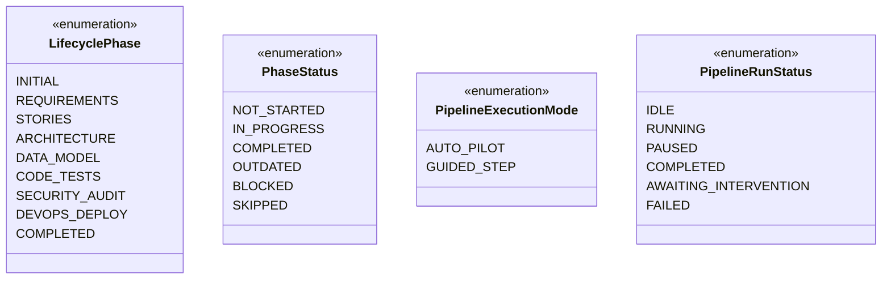
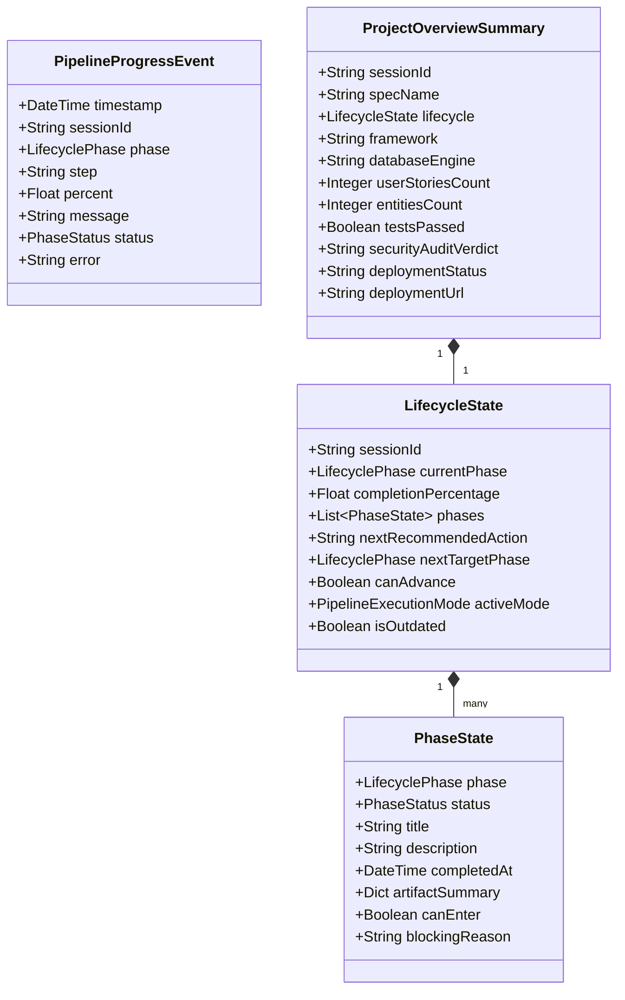
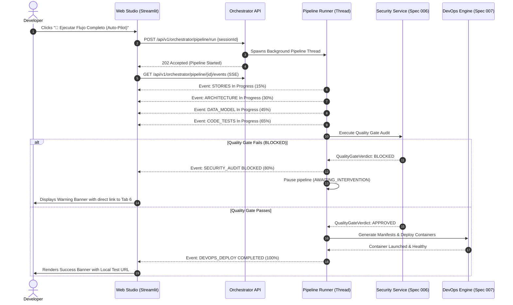
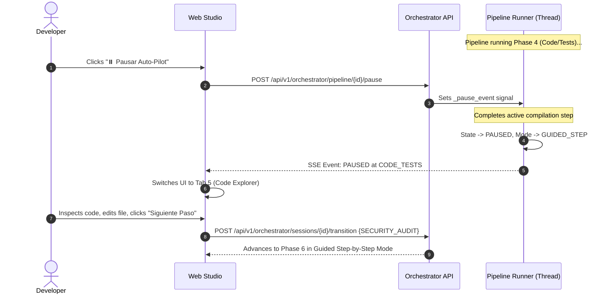

# Data Model: Unified End-to-End Workflow Orchestration

**Feature**: `008-unified-workflow-orchestration`  
**Date**: 2026-09-13  
**Status**: Completed  

---

## 1. Domain Entities & Enums

### 1.1 Enumerations



### 1.2 Core Data Models



---

## 2. Pydantic Models Definition (`backend/app/models/orchestrator.py`)

```python
from datetime import datetime
from enum import Enum
from typing import Any, Dict, List, Optional
from pydantic import BaseModel, Field


class LifecyclePhase(str, Enum):
    INITIAL = "INITIAL"
    REQUIREMENTS = "REQUIREMENTS"
    STORIES = "STORIES"
    ARCHITECTURE = "ARCHITECTURE"
    DATA_MODEL = "DATA_MODEL"
    CODE_TESTS = "CODE_TESTS"
    SECURITY_AUDIT = "SECURITY_AUDIT"
    DEVOPS_DEPLOY = "DEVOPS_DEPLOY"
    COMPLETED = "COMPLETED"


class PhaseStatus(str, Enum):
    NOT_STARTED = "NOT_STARTED"
    IN_PROGRESS = "IN_PROGRESS"
    COMPLETED = "COMPLETED"
    OUTDATED = "OUTDATED"
    BLOCKED = "BLOCKED"
    SKIPPED = "SKIPPED"


class PipelineExecutionMode(str, Enum):
    AUTO_PILOT = "AUTO_PILOT"
    GUIDED_STEP = "GUIDED_STEP"


class PipelineRunStatus(str, Enum):
    IDLE = "IDLE"
    RUNNING = "RUNNING"
    PAUSED = "PAUSED"
    COMPLETED = "COMPLETED"
    AWAITING_INTERVENTION = "AWAITING_INTERVENTION"
    FAILED = "FAILED"


class PhaseState(BaseModel):
    phase: LifecyclePhase
    status: PhaseStatus = PhaseStatus.NOT_STARTED
    title: str
    description: str
    completedAt: Optional[datetime] = None
    artifactSummary: Dict[str, Any] = Field(default_factory=dict)
    canEnter: bool = False
    blockingReason: Optional[str] = None


class LifecycleState(BaseModel):
    sessionId: str
    currentPhase: LifecyclePhase = LifecyclePhase.INITIAL
    completionPercentage: float = 0.0
    phases: List[PhaseState] = Field(default_factory=list)
    nextRecommendedAction: str = "Ingresar o confirmar requisitos del microservicio"
    nextTargetPhase: Optional[LifecyclePhase] = LifecyclePhase.REQUIREMENTS
    canAdvance: bool = True
    activeMode: PipelineExecutionMode = PipelineExecutionMode.GUIDED_STEP
    isOutdated: bool = False


class PipelineRunRequest(BaseModel):
    sessionId: str
    targetPhase: Optional[LifecyclePhase] = LifecyclePhase.DEVOPS_DEPLOY
    stopOnGate: bool = True
    autoDeploy: bool = False


class PipelineProgressEvent(BaseModel):
    timestamp: datetime = Field(default_factory=datetime.utcnow)
    sessionId: str
    phase: LifecyclePhase
    step: str
    percent: float
    message: str
    status: PhaseStatus = PhaseStatus.IN_PROGRESS
    error: Optional[str] = None


class PhaseTransitionRequest(BaseModel):
    targetPhase: LifecyclePhase
    force: bool = False


class ProjectOverviewSummary(BaseModel):
    sessionId: str
    specName: str
    lifecycle: LifecycleState
    framework: str = "Java 21 / Spring Boot 3"
    databaseEngine: str = "POSTGRESQL"
    userStoriesCount: int = 0
    entitiesCount: int = 0
    testsPassed: bool = False
    securityAuditVerdict: str = "PENDING"
    deploymentStatus: str = "IDLE"
    deploymentUrl: Optional[str] = None
```

---

## 3. Sequence Diagrams

### 3.1 Autonomous Auto-Pilot Execution with Quality Gate Guard



### 3.2 Hot-Pausing & Mode Switching Sequence



