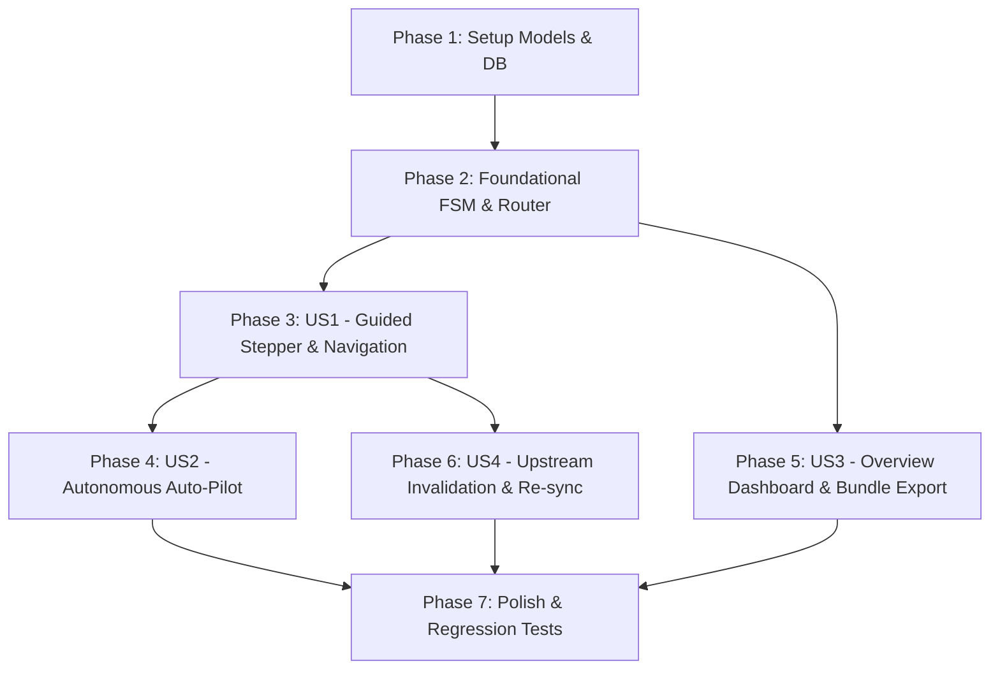

# Tasks: End-to-End Unified Workflow Orchestration

**Branch**: `008-unified-workflow-orchestration` | **Date**: 2026-09-13 | **Spec**: [specs/008-unified-workflow-orchestration/spec.md](file:///c:/Users/willi/Downloads/agentIA/specs/008-unified-workflow-orchestration/spec.md) | **Plan**: [specs/008-unified-workflow-orchestration/plan.md](file:///c:/Users/willi/Downloads/agentIA/specs/008-unified-workflow-orchestration/plan.md)

---

## Phase 1: Setup (Shared Infrastructure)

**Purpose**: Establish orchestrator domain models, lifecycle enums, and database persistence extensions.

- [X] T001 Create orchestrator domain models and enums in `backend/app/models/orchestrator.py` including `LifecyclePhase`, `PhaseStatus`, `PipelineExecutionMode`, `PipelineRunStatus`, `PhaseState`, `LifecycleState`, `PipelineRunRequest`, `PipelineProgressEvent`, `PhaseTransitionRequest`, and `ProjectOverviewSummary`
- [X] T002 [P] Extend `GenerationSessionDB` in `backend/app/models/session.py` with `current_lifecycle_phase`, `lifecycle_mode`, and `phase_progress_json` columns for persistent state storage

---

## Phase 2: Foundational (Blocking Prerequisites)

**Purpose**: Core finite state machine (FSM) engine, prerequisite transition guards, and API router skeleton that all user stories depend on.

- [X] T003 Implement `LifecycleService` core FSM and prerequisite validator in `backend/app/services/lifecycle_service.py` with phase transitions (`INITIAL` ➔ `REQUIREMENTS` ➔ `STORIES` ➔ `ARCHITECTURE` ➔ `DATA_MODEL` ➔ `CODE_TESTS` ➔ `SECURITY_AUDIT` ➔ `DEVOPS_DEPLOY` ➔ `COMPLETED`)
- [X] T004 [P] Create FastAPI orchestrator router in `backend/app/api/routes_orchestrator.py` and register it under prefix `/api/v1/orchestrator` in `backend/app/main.py`

---

## Phase 3: User Story 1 - Guided Step-by-Step Lifecycle Wizard & Persistent Stepper (Priority: P1) 🎯 MVP

**Goal**: Provide a persistent top-level progress stepper and contextual Next Action Bar enabling developers to navigate the 7 lifecycle phases seamlessly with prerequisite validation.

**Independent Test**: Launch the Web Studio, verify that the 7-phase Stepper is visible at the top, inspect active phase status, and verify that clicking "Siguiente Paso" validates prerequisites and transitions smoothly between tabs.

### Tests for User Story 1
- [X] T005 [P] [US1] Unit tests for lifecycle FSM transitions and prerequisite invariant validation in `backend/tests/test_lifecycle_service.py`
- [X] T006 [P] [US1] Contract tests for `/api/v1/orchestrator/sessions/{session_id}/lifecycle` and `/transition` in `backend/tests/test_routes_orchestrator.py`

### Implementation for User Story 1
- [X] T007 [US1] Implement `get_session_lifecycle` and `transition_phase` in `backend/app/services/lifecycle_service.py` inspecting existing workspace artifacts and session records
- [X] T008 [US1] Implement endpoints `GET /api/v1/orchestrator/sessions/{session_id}/lifecycle` and `POST /api/v1/orchestrator/sessions/{session_id}/transition` in `backend/app/api/routes_orchestrator.py`
- [X] T009 [US1] Create persistent Stepper component in `frontend/views/lifecycle_stepper.py` with 7 phase badges, progress bar, interactive click navigation to unlocked phases, and contextual Next Action Bar
- [X] T010 [US1] Embed `render_lifecycle_stepper` at the top of the main layout in `frontend/app.py` synchronizing active tab state

**Checkpoint**: User Story 1 is complete — developers experience an interactive, guided step-by-step workflow with a persistent Stepper across all tabs.

---

## Phase 4: User Story 2 - One-Click Autonomous Auto-Pilot Pipeline (Priority: P1)

**Goal**: Execute the full microservice synthesis pipeline end-to-end in the background with real-time SSE progress events, hot-pausing capabilities, and constitutional safe-halting on Quality Gate blocks.

**Independent Test**: Trigger Auto-Pilot via API or UI button, observe real-time progress events from 0% to 100%, test pausing mid-flight to switch to guided mode, and verify that simulated security flaws halt the pipeline at Phase 6.

### Tests for User Story 2
- [X] T011 [P] [US2] Unit and integration tests for Auto-Pilot background sequencing, hot-pausing, and Quality Gate halting in `backend/tests/test_pipeline_runner.py`
- [X] T012 [P] [US2] Contract tests for `/api/v1/orchestrator/pipeline/run`, `/pause`, `/resume`, and SSE `/events` in `backend/tests/test_routes_orchestrator.py`

### Implementation for User Story 2
- [X] T013 [US2] Implement asynchronous `PipelineRunner` in `backend/app/services/pipeline_runner.py` with sequential execution through specs 002 to 007, cooperative hot-pausing via `_pause_event`, and thread-safe SSE log queue
- [X] T014 [US2] Implement endpoints `POST /api/v1/orchestrator/pipeline/run`, `POST /pipeline/{session_id}/pause`, `POST /pipeline/{session_id}/resume`, and `GET /pipeline/{session_id}/events` in `backend/app/api/routes_orchestrator.py`
- [X] T015 [US2] Integrate Auto-Pilot launch button, "⏸️ Pausar" hot-control, and live progress bar into `frontend/views/lifecycle_stepper.py`

**Checkpoint**: User Stories 1 and 2 work together — developers can either advance step-by-step or run Auto-Pilot with hot-pausing.

---

## Phase 5: User Story 3 - Centralized Session Continuity, Overview Dashboard & Complete Bundle Export (Priority: P2)

**Goal**: Provide a central Project Overview Dashboard (Home View) showing key project metrics, unified session continuity, and a 1-click complete ZIP bundle exporter.

**Independent Test**: Access the Overview screen, verify metadata and metrics cards, and download the full ZIP bundle verifying that documentation, code, tests, SQL, Dockerfile, CI/CD, and K8s manifests are properly bundled.

### Tests for User Story 3
- [X] T016 [P] [US3] Unit tests for complete bundle ZIP packaging in `backend/tests/test_export_service.py`
- [X] T017 [P] [US3] Contract tests for `/api/v1/orchestrator/sessions/{session_id}/overview` and `/export-bundle` in `backend/tests/test_routes_orchestrator.py`

### Implementation for User Story 3
- [X] T018 [US3] Implement `export_full_bundle` in `backend/app/services/export_service.py` packaging all docs, SQL, Java Maven project, test reports, security audit, Dockerfile, Compose, CI/CD, and K8s manifests into a structured ZIP file
- [X] T019 [US3] Implement `get_project_overview` in `backend/app/services/lifecycle_service.py` compiling milestone metrics (stories count, entities, test results, security audit, deployment URL)
- [X] T020 [US3] Implement endpoints `GET /api/v1/orchestrator/sessions/{session_id}/overview` and `GET /sessions/{session_id}/export-bundle` in `backend/app/api/routes_orchestrator.py`
- [X] T021 [US3] Create Project Overview Dashboard in `frontend/views/overview_view.py` ("🏠 0. Resumen del Proyecto") with project metadata, visual pipeline stepper, mode action buttons, metrics grid, and ZIP download button
- [X] T022 [US3] Integrate Tab 0 ("🏠 0. Resumen") as the initial landing tab in `frontend/app.py`

**Checkpoint**: Overview dashboard and complete bundle export are functional, serving as the central cockpit for any microservice project.

---

## Phase 6: User Story 4 - Upstream Change Invalidation & Re-Synchronization (Priority: P2)

**Goal**: Non-destructively flag downstream phases as `OUTDATED` when upstream artifacts are modified, offering a 1-click re-synchronization action.

**Independent Test**: Modify an upstream requirement, verify that downstream phases show `OUTDATED` with amber warning badges without losing files, and trigger re-sync to regenerate affected downstream phases.

### Implementation for User Story 4
- [X] T023 [US4] Implement `mark_downstream_outdated` in `backend/app/services/lifecycle_service.py` and integrate re-sync trigger into `frontend/views/lifecycle_stepper.py` and `frontend/views/overview_view.py`

**Checkpoint**: Full iterative development cycle is supported safely without accidental data loss.

---

## Phase 7: Polish & Cross-Cutting Concerns

**Purpose**: End-to-end scenario validation, full regression test execution, and documentation polishing.

- [X] T024 [P] Validate all 5 scenarios from `specs/008-unified-workflow-orchestration/quickstart.md` using the implemented endpoints
- [X] T025 Execute full backend pytest suite across all existing 106 tests plus new orchestrator tests ensuring 100% pass rate without regressions in `backend/tests/`
- [X] T026 [P] Add OpenAPI documentation and comprehensive docstrings across `lifecycle_service.py`, `pipeline_runner.py`, and `routes_orchestrator.py`

---

## Dependencies & Execution Order

### Phase Dependencies

- **Setup (Phase 1)**: No dependencies — can start immediately
- **Foundational (Phase 2)**: Depends on Phase 1 completion — BLOCKS all user stories
- **User Stories (Phases 3–6)**: Depend on Phase 2 completion
  - US1 (Phase 3): Guided Step-by-Step Stepper (MVP)
  - US2 (Phase 4): Autonomous Auto-Pilot Pipeline (integrates US1)
  - US3 (Phase 5): Overview Dashboard & Bundle Export
  - US4 (Phase 6): Upstream Invalidation & Re-sync
- **Polish (Phase 7)**: Depends on all user stories being complete



---

## Parallel Execution Examples

### User Story 1 & 2
```bash
# Stepper UI component and Auto-Pilot background runner can be implemented in parallel once Foundational phase is complete:
Task: "T009 [US1] Create persistent Stepper component in frontend/views/lifecycle_stepper.py"
Task: "T013 [US2] Implement asynchronous PipelineRunner in backend/app/services/pipeline_runner.py"
```

### User Story 3 & 4
```bash
# Bundle export service and downstream outdated propagation can run in parallel:
Task: "T018 [US3] Implement export_full_bundle in backend/app/services/export_service.py"
Task: "T023 [US4] Implement mark_downstream_outdated in backend/app/services/lifecycle_service.py"
```

---

## Implementation Strategy

### MVP First (User Story 1 Only)
1. Complete Phase 1: Models and DB extension
2. Complete Phase 2: Foundational FSM & router
3. Complete Phase 3: Guided Step-by-Step Stepper & navigation
4. Validate step-by-step transitions across tabs

### Incremental Delivery
1. **Increment 1 (MVP)**: Persistent Stepper with progress bar and "Siguiente Paso" action bar.
2. **Increment 2**: One-Click Auto-Pilot pipeline execution with real-time SSE progress events and hot-pausing.
3. **Increment 3**: Project Overview Home View dashboard and 1-click complete bundle ZIP export.
4. **Increment 4**: Upstream change invalidation with `OUTDATED` status flags and 1-click re-synchronization.
5. **Increment 5**: Full quickstart scenario validation and regression testing across all 106 existing tests.

