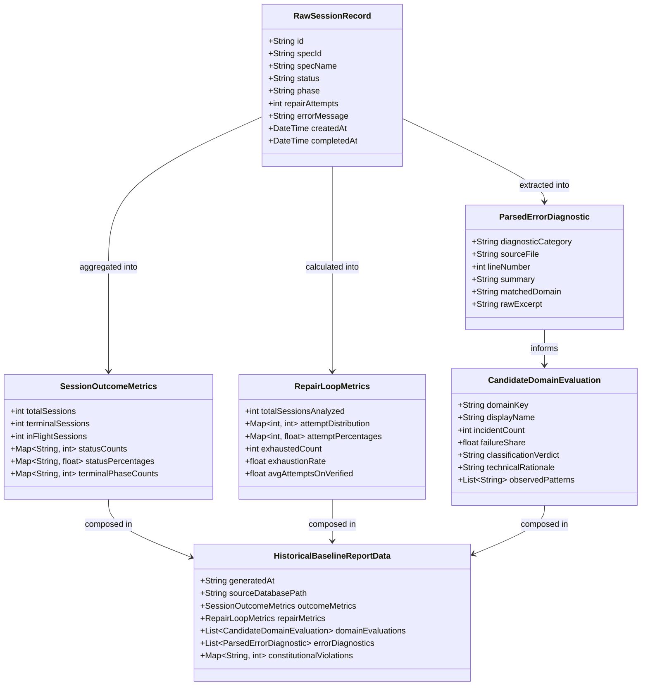

# Data Model: Historical Baseline Analysis

**Feature**: Historical Baseline Analysis for AgentIA Skill Injection Pilot  
**Branch**: `009-historical-baseline-analysis`  
**Date**: 2026-09-25  

---

## 1. Entity Overview

The baseline analysis pipeline ingests raw relational records from `studio.db` and structures them into strongly typed statistical metrics and domain evaluations.



---

## 2. Entity Specifications

### 2.1 `RawSessionRecord`
Represents an immutable snapshot of a single row queried from `generation_sessions`.

| Field | Type | Nullable | Description |
| :--- | :--- | :---: | :--- |
| `id` | `String (UUID)` | No | Unique session ID. |
| `spec_id` | `String` | Yes | Identifier of the specification generated. |
| `spec_name` | `String` | No | Human-readable name of the specification. |
| `status` | `String` | No | Session terminal state (`QUEUED`, `RUNNING`, `PAUSED`, `COMPLETED`, `BLOCKED`, `CANCELLED`). |
| `phase` | `String` | No | Final lifecycle execution phase (`INITIALIZATION`, `CODE_GENERATION`, `SANDBOX_BUILD`, `TEST_EXECUTION`, `SELF_REPAIR`, `VERIFIED`, `FAILED`). |
| `repair_attempts` | `Integer` | No | Number of auto-repair loop iterations executed (0..3+). |
| `error_message` | `Text` | Yes | Raw stderr, Surefire assertion logs, or compiler output. |
| `created_at` | `DateTime` | No | Timestamp when session was queued. |
| `completed_at` | `DateTime` | Yes | Timestamp when session reached terminal state. |

---

### 2.2 `SessionOutcomeMetrics`
Quantifies terminal outcomes across all historical sessions.

| Field | Type | Description |
| :--- | :--- | :--- |
| `total_sessions` | `Integer` | Total count of all session rows in database. |
| `terminal_sessions` | `Integer` | Sessions that reached a final state (`COMPLETED`, `BLOCKED`, `CANCELLED`, `VERIFIED`, `FAILED`). |
| `in_flight_sessions` | `Integer` | Sessions currently marked `QUEUED`, `RUNNING`, or `PAUSED`. |
| `status_counts` | `Dict[str, int]` | Frequency count per status string. |
| `status_percentages` | `Dict[str, float]` | Percentage share of each status relative to terminal sessions. |
| `phase_counts` | `Dict[str, int]` | Distribution of terminal phases (e.g. `VERIFIED` vs `FAILED` vs `TEST_EXECUTION`). |

---

### 2.3 `RepairLoopMetrics`
Quantifies the behavior and limits of the autonomous self-repair cycle.

| Field | Type | Description |
| :--- | :--- | :--- |
| `attempt_distribution` | `Dict[int, int]` | Count of sessions requiring exactly 0, 1, 2, or 3+ attempts. |
| `attempt_percentages` | `Dict[int, float]` | Percentage of sessions for each attempt count. |
| `exhausted_count` | `Integer` | Count of sessions that hit max attempts (>=3) and still ended in `BLOCKED` or `FAILED`. |
| `exhaustion_rate` | `Float` | Percentage of repair-loop invocations that failed to recover. |
| `first_attempt_recovery_rate` | `Float` | Percentage of failed sessions successfully recovered on attempt 1. |

---

### 2.4 `CandidateDomainEvaluation`
Represents the pilot triage scorecard for each candidate domain.

| Field | Type | Description |
| :--- | :--- | :--- |
| `domain_key` | `String` | Canonical enum key (`jakarta_namespace`, `layer_architecture`, `exception_handling`, `maven_pom`, `mockito_tests`). |
| `display_name` | `String` | Clean stakeholder title (e.g. "Jakarta EE 10 Namespace Migration"). |
| `incident_count` | `Integer` | Exact raw count of matching errors observed in logs. |
| `failure_share` | `Float` | Percentage of total error incidents attributable to this domain. |
| `classification_verdict` | `Enum` | `skill-layer appropriate`, `deterministic-fixer appropriate`, or `not observed`. |
| `technical_rationale` | `String` | Justification based on problem complexity, regularity, and LLM reasoning requirements. |
| `observed_patterns` | `List[str]` | Representative snippets or regex signatures found in the historical data. |

---

### 2.5 `Candidate Domain Enum & Taxonomy`

```text
Domain: jakarta_namespace
  - Signatures: javax.persistence.*, javax.validation.*, javax.servlet.*, javax.annotation.*
  - Target: Spring Boot 3 / Java 21 Jakarta imports
  - Expected Classification: deterministic-fixer appropriate

Domain: layer_architecture
  - Signatures: Repository called from Controller, JPA Entity returned from Controller, Principle I
  - Target: 4-layer isolation (Controller -> Service -> Repository -> Entity)
  - Expected Classification: skill-layer appropriate

Domain: exception_handling
  - Signatures: try/catch in Controller, ad-hoc ErrorResponse, missing @RestControllerAdvice, Principle III
  - Target: Centralized RFC 7807 ProblemDetails error handling
  - Expected Classification: skill-layer appropriate (or hybrid)

Domain: maven_pom
  - Signatures: pom.xml failure, Unresolvable dependency, Plugin execution error, Principle IV
  - Target: Deterministic offline build configuration
  - Expected Classification: deterministic-fixer appropriate

Domain: mockito_tests
  - Signatures: UnnecessaryStubbingException, Strictness, ArgumentMismatch, Wanted but not invoked
  - Target: Spring Boot unit/slice tests and Mockito stubbing correctness
  - Expected Classification: skill-layer appropriate
```
