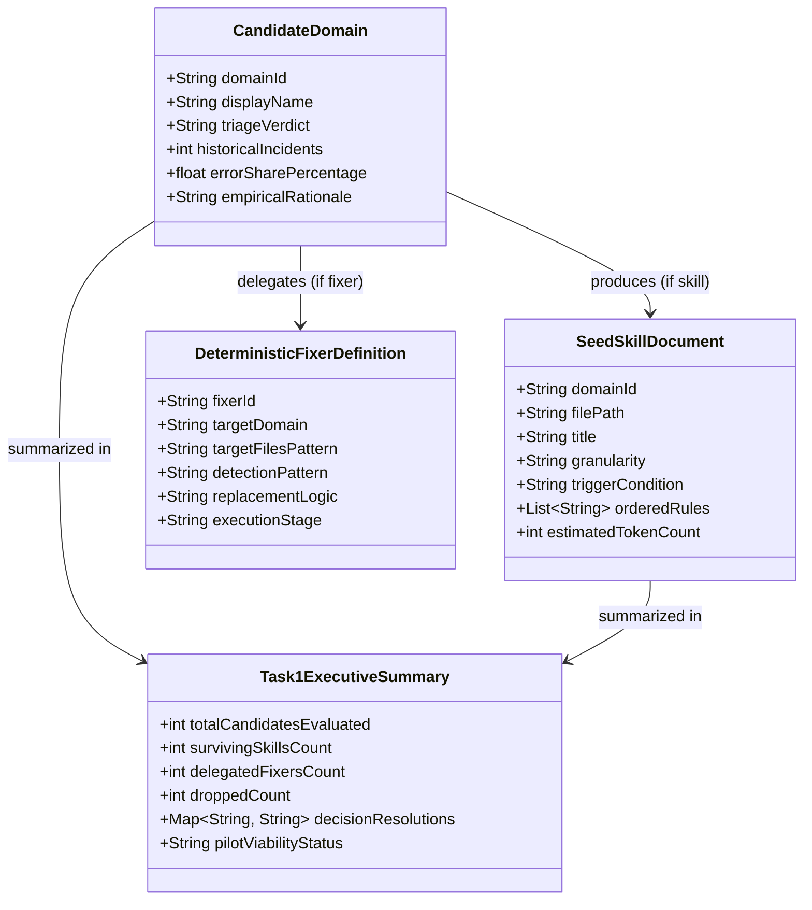

# Data Model: Skill Injection Pilot Asset Specifications

**Feature**: Finalize Skill Domain Set and Author Seed Skill Documents  
**Branch**: `010-skill-injection`  
**Date**: 2026-09-25  

---

## 1. Entity Overview

---

## 2. Entity Details

### 2.1 `CandidateDomain`
Represents an evaluated problem domain from the historical baseline report.

| Field | Type | Allowed Values | Description |
| :--- | :--- | :--- | :--- |
| `domain_id` | `String` | `jakarta_namespace`, `layer_architecture`, `exception_handling`, `maven_pom`, `mockito_tests` | Canonical unique identifier. |
| `display_name` | `String` | e.g. "Architectural Layer Isolation" | Human-readable title. |
| `triage_verdict` | `Enum` | `skill-layer appropriate`, `deterministic-fixer appropriate`, `dropped/not observed` | Remediation channel decision. |
| `historical_incidents` | `Integer` | >= 0 | Raw count from `reports/009-historical-baseline.md`. |
| `error_share_percentage`| `Float` | 0.0 - 100.0 | Relative share of total historical error sessions. |
| `empirical_rationale` | `String` | Text | Technical justification citing baseline figures. |

---

### 2.2 `SeedSkillDocument`
Represents an authored, version-frozen markdown skill artifact stored in `backend/app/resources/skills/`.

| Field | Type | Validation Constraints | Description |
| :--- | :--- | :--- | :--- |
| `domain_id` | `String` | Matches a surviving `CandidateDomain`. | Foreign key to domain. |
| `file_path` | `String` | `backend/app/resources/skills/<domain_id>.md` | Relative path to skill markdown file. |
| `title` | `String` | Plain text, no file paths or class names. | Conceptual title of skill. |
| `granularity` | `Enum` | `task-level` or `event-driven` | Lifecycle activation level. |
| `trigger_condition` | `String` | High-level, zero instance literals. | Context when skill must fire. |
| `ordered_rules` | `List[String]` | Imperative verbs, sequential numbering. | Procedural execution guidelines. |
| `estimated_token_count`| `Integer` | < 500 tokens | Size of the skill file. |

---

### 2.3 `DeterministicFixerDefinition`
Represents the structural specification of an automated AST/regex transformation pass in `specs/010-skill-injection/fixers.md`.

| Field | Type | Allowed Values | Description |
| :--- | :--- | :--- | :--- |
| `fixer_id` | `String` | `FIX-JAKARTA-NAMESPACE`, `FIX-POM-OFFLINE-DEPS` | Unique fixer identifier. |
| `target_domain` | `String` | `jakarta_namespace`, `maven_pom` | Associated candidate domain. |
| `target_files_pattern`| `String` | `**/*.java`, `pom.xml` | Glob pattern of files touched. |
| `detection_pattern` | `String` | Regex or AST query | Rule to identify defective code. |
| `replacement_logic` | `String` | Substitution syntax or XML fragment | Deterministic patch operation. |
| `execution_stage` | `Enum` | `post-generation`, `pre-build` | Point in pipeline where fixer runs. |

---

### 2.4 `Task1ExecutiveSummary`
Represents the final synthesis in `specs/010-skill-injection/task1-summary.md`.

| Field | Type | Description |
| :--- | :--- | :--- |
| `total_candidates_evaluated` | `Integer` | Total candidate domains evaluated (5). |
| `surviving_skills_count` | `Integer` | Count of domains surviving into skill pilot (3). |
| `delegated_fixers_count` | `Integer` | Count of domains triaged to fixers (2). |
| `dropped_count` | `Integer` | Count of unobserved or dropped domains (0). |
| `decision_resolutions` | `Dict[str, str]` | Explicit resolutions for the 3 open questions. |
| `pilot_viability_status` | `String` | "VIABLE" (exceeds threshold of >= 2 surviving domains). |
